# yoss_tr_test

## Tables

| Name | Columns | Comment | Type |
| ---- | ------- | ------- | ---- |
| [public.users_school](public.users_school.md) | 5 | ユーザ所属学校テーブル | BASE TABLE |
| [public.active_semester_setting](public.active_semester_setting.md) | 3 | 期別設定中テーブル | BASE TABLE |
| [public.class](public.class.md) | 17 | 学級テーブル | BASE TABLE |
| [public.class_daito](public.class_daito.md) | 17 |  | BASE TABLE |
| [public.contract](public.contract.md) | 14 | 契約テーブル | BASE TABLE |
| [public.export_file](public.export_file.md) | 7 | エクスポートファイル | BASE TABLE |
| [public.information](public.information.md) | 13 | お知らせテーブル | BASE TABLE |
| [public.information_read](public.information_read.md) | 3 |  | BASE TABLE |
| [public.m_facility_group](public.m_facility_group.md) | 6 | 施設区分マスタ | BASE TABLE |
| [public.m_region_resource](public.m_region_resource.md) | 61 | 地域資源マスタ | BASE TABLE |
| [public.municipality](public.municipality.md) | 6 | 自治体マスタテーブル | BASE TABLE |
| [public.password_reset_requests](public.password_reset_requests.md) | 7 |  | BASE TABLE |
| [public.personal_info_access_tokens](public.personal_info_access_tokens.md) | 7 | 個人情報保管アクセストークンテーブル | BASE TABLE |
| [public.personal_info_login_users](public.personal_info_login_users.md) | 7 | 個人情報保管ログインユーザテーブル | BASE TABLE |
| [public.proceedings](public.proceedings.md) | 8 | 児童別議事録 | BASE TABLE |
| [public.proceedings_actions](public.proceedings_actions.md) | 25 | 議事録アクション | BASE TABLE |
| [public.proceedings_region_resource](public.proceedings_region_resource.md) | 15 | 議事録地域資源 | BASE TABLE |
| [public.pupil](public.pupil.md) | 7 | 児童生徒テーブル | BASE TABLE |
| [public.pupil_response_flag](public.pupil_response_flag.md) | 6 |  | BASE TABLE |
| [public.region_resource_tenant_coinfig](public.region_resource_tenant_coinfig.md) | 7 | 地域資源_テナント設定 | BASE TABLE |
| [public.school](public.school.md) | 9 | 学校テーブル | BASE TABLE |
| [public.school_response_flag](public.school_response_flag.md) | 10 |  | BASE TABLE |
| [public.school_setting](public.school_setting.md) | 49 | 学校設定テーブル | BASE TABLE |
| [public.semester](public.semester.md) | 8 | 期別テーブル | BASE TABLE |
| [public.session](public.session.md) | 3 | セッションテーブル | BASE TABLE |
| [public.tenant](public.tenant.md) | 18 | テナントテーブル | BASE TABLE |
| [public.terms](public.terms.md) | 5 | 利用規約テーブル | BASE TABLE |
| [public.user_passkeys](public.user_passkeys.md) | 7 |  | BASE TABLE |
| [public.users](public.users.md) | 19 | ユーザテーブル | BASE TABLE |

## Relations

```mermaid
erDiagram

"public.active_semester_setting" |o--|| "public.school" : "FOREIGN KEY (school_code) REFERENCES school(school_code)"
"public.password_reset_requests" }o--|| "public.users" : "FOREIGN KEY (user_id) REFERENCES users(user_id)"
"public.personal_info_access_tokens" |o--|| "public.personal_info_login_users" : "FOREIGN KEY (personal_info_login_user_id) REFERENCES personal_info_login_users(id)"
"public.user_passkeys" }o--|| "public.users" : "FOREIGN KEY (user_id) REFERENCES users(user_id)"
"public.users_school" }o--|| "public.school" : "Additional Relation"
"public.class" }o--|| "public.school" : "Additional Relation"
"public.class_daito" }o--|| "public.school" : "Additional Relation"
"public.information" }o--o| "public.school" : "Additional Relation"
"public.proceedings" }o--|| "public.school" : "Additional Relation"
"public.school_response_flag" }o--|| "public.school" : "Additional Relation"
"public.school_setting" }o--|| "public.school" : "Additional Relation"
"public.semester" }o--|| "public.school" : "Additional Relation"
"public.contract" }o--|| "public.tenant" : "Additional Relation"
"public.export_file" }o--|| "public.tenant" : "Additional Relation"
"public.information" }o--o| "public.tenant" : "Additional Relation"
"public.password_reset_requests" }o--|| "public.tenant" : "Additional Relation"
"public.region_resource_tenant_coinfig" |o--|| "public.tenant" : "Additional Relation"
"public.school" }o--o| "public.tenant" : "Additional Relation"
"public.user_passkeys" }o--|| "public.tenant" : "Additional Relation"
"public.users" }o--|| "public.tenant" : "Additional Relation"
"public.users_school" }o--|| "public.users" : "Additional Relation"
"public.information_read" }o--|| "public.users" : "Additional Relation"
"public.session" }o--|| "public.users" : "Additional Relation"
"public.class" }o--|| "public.pupil" : "Additional Relation"
"public.class_daito" }o--|| "public.pupil" : "Additional Relation"
"public.proceedings" }o--|| "public.pupil" : "Additional Relation"
"public.pupil_response_flag" }o--|| "public.class" : "Additional Relation"
"public.proceedings" }o--|| "public.semester" : "Additional Relation"
"public.m_region_resource" }o--o| "public.m_facility_group" : "Additional Relation"
"public.pupil_response_flag" }o--|| "public.school_response_flag" : "Additional Relation"
"public.information_read" }o--|| "public.information" : "Additional Relation"
"public.proceedings_actions" |o--|| "public.proceedings" : "Additional Relation"
"public.proceedings_region_resource" |o--|| "public.proceedings" : "Additional Relation"

"public.users_school" {
  integer user_id
  varchar_32_ school_code
  timestamp_6__without_time_zone updated_at
  integer registered_user_id
  integer updated_user_id
}
"public.active_semester_setting" {
  varchar_32_ school_code FK
  timestamp_without_time_zone setting_start_at
  integer registered_user_id
}
"public.class" {
  integer class_id
  varchar_32_ school_code
  smallint year
  varchar_32_ grade
  varchar_32_ class_name
  smallint number
  integer pupil_id
  varchar_32_ next_grade
  varchar_32_ next_class
  smallint next_number
  varchar_32_ school_continuance_code
  varchar_32_ transfer_school_code
  timestamp_without_time_zone updated_at
  integer registered_user_id
  integer updated_user_id
  smallint pupil_type
  boolean pupil_accept_flag
}
"public.class_daito" {
  integer class_id
  varchar_32_ school_code
  smallint year
  varchar_32_ grade
  varchar_32_ class_name
  smallint number
  integer pupil_id
  varchar_32_ next_grade
  varchar_32_ next_class
  smallint next_number
  varchar_32_ school_continuance_code
  varchar_32_ transfer_school_code
  timestamp_6__without_time_zone updated_at
  integer registered_user_id
  integer updated_user_id
  smallint pupil_type
  boolean pupil_accept_flag
}
"public.contract" {
  integer contract_id
  varchar_64_ prefectures
  varchar_64_ municipality
  varchar_64_ tenant_id
  varchar_64_ contractor_name
  varchar_64_ contractor_name_kana
  timestamp_without_time_zone start_date
  timestamp_without_time_zone end_date
  varchar_64_ contract_manager
  varchar_64_ mail_address
  varchar_64_ contact_method
  timestamp_without_time_zone updated_at
  integer registered_user_id
  integer updated_user_id
}
"public.export_file" {
  varchar_64_ tenant_id
  varchar_1_ file_kbn
  integer status_code
  varchar_256_ file_path
  timestamp_6__without_time_zone create_file_datetime
  timestamp_6__without_time_zone updated_at
  integer updated_user_id
}
"public.information" {
  integer information_id
  varchar_256_ information
  timestamp_without_time_zone updated_at
  integer registered_user_id
  integer updated_user_id
  smallint information_type
  varchar_32_ school_code
  timestamp_without_time_zone registered_date
  varchar_128_ title
  varchar_64_ tenant_id
  timestamp_6__without_time_zone display_start_at
  timestamp_6__without_time_zone display_end_at
  boolean is_forced
}
"public.information_read" {
  integer information_id
  integer user_id
  timestamp_6__without_time_zone read_at
}
"public.m_facility_group" {
  integer facility_group_code
  varchar_16_ facility_group
  timestamp_6__without_time_zone registered_at
  timestamp_6__without_time_zone updated_at
  integer registered_user_id
  integer updated_user_id
}
"public.m_region_resource" {
  integer region_resource_id
  varchar_1_ end_flag
  varchar_1_ pause_flag
  varchar_64_ region_resource_name
  integer facility_group_code
  varchar_256_ facility_explanation
  varchar_16_ facility_tel1
  varchar_16_ facility_tel2
  varchar_10_ facility_post_code
  varchar_128_ facility_address
  varchar_64_ facility_email
  varchar_128_ facility_url
  integer facility_capacity
  integer facility_price
  time_without_time_zone facility_starttime
  time_without_time_zone facility_endtime
  varchar_32_ facility_close
  varchar_256_ facility_remark
  varchar_1_ infrant
  varchar_1_ student
  varchar_1_ jstudent
  varchar_1_ hstudent
  varchar_1_ anyone
  varchar_1_ parents
  varchar_1_ support_a1
  varchar_1_ support_a2
  varchar_1_ support_a3
  varchar_1_ support_a4
  varchar_1_ support_a5
  varchar_1_ support_a6
  varchar_1_ support_a7
  varchar_1_ support_a8
  varchar_1_ support_b1
  varchar_1_ support_b2
  varchar_1_ support_b3
  varchar_1_ support_b4
  varchar_1_ support_b5
  varchar_1_ support_b6
  varchar_1_ support_b7
  varchar_1_ support_b8
  varchar_1_ support_c1
  varchar_1_ support_c2
  varchar_1_ support_c3
  varchar_1_ support_c4
  varchar_1_ support_c5
  varchar_64_ organization_name
  varchar_32_ organization_representative
  varchar_16_ organization_tel1
  varchar_16_ organization_tel2
  varchar_10_ organization_post_code
  varchar_128_ organization_address
  varchar_64_ organization_email
  varchar_128_ organization_url
  varchar_256_ organization_remark
  varchar_64_ prefectures
  timestamp_6__without_time_zone registered_at
  varchar_64_ registered_tenant_id
  integer registered_user_id
  timestamp_6__without_time_zone updated_at
  varchar_32_ updated_tenant_id
  integer updated_user_id
}
"public.municipality" {
  integer municipality_id
  varchar_64_ prefectures
  varchar_64_ municipality
  timestamp_without_time_zone updated_at
  integer registered_user_id
  integer updated_user_id
}
"public.password_reset_requests" {
  integer request_id
  integer user_id FK
  varchar_64_ tenant_id
  smallint request_status
  timestamp_6__without_time_zone requested_at
  timestamp_6__without_time_zone processed_at
  integer processed_by_user_id
}
"public.personal_info_access_tokens" {
  integer personal_info_login_user_id FK
  varchar_32_ unique_id
  varchar_200_ access_token
  timestamp_6__without_time_zone registered_at
  integer registered_user_id
  timestamp_6__without_time_zone updated_at
  integer updated_user_id
}
"public.personal_info_login_users" {
  integer id
  varchar_32_ fapp_id
  varchar_255_ user_id
  timestamp_6__without_time_zone registered_at
  integer registered_user_id
  timestamp_6__without_time_zone updated_at
  integer updated_user_id
}
"public.proceedings" {
  integer proceedings_id
  varchar_64_ school_code
  integer pupil_id
  integer semester_id
  timestamp_6__without_time_zone registered_at
  timestamp_6__without_time_zone updated_at
  integer registered_user_id
  integer updated_user_id
}
"public.proceedings_actions" {
  integer proceedings_id
  varchar_64_ action_name1
  integer action1
  varchar_64_ action_name2
  integer action2
  varchar_64_ action_name3
  integer action3
  varchar_64_ action_name4
  integer action4
  varchar_64_ action_name5
  integer action5
  varchar_64_ action_name6
  integer action6
  varchar_64_ action_name7
  integer action7
  varchar_64_ action_name8
  integer action8
  varchar_64_ action_name9
  integer action9
  varchar_64_ action_name10
  integer action10
  timestamp_6__without_time_zone registered_at
  timestamp_6__without_time_zone updated_at
  integer registered_user_id
  integer updated_user_id
}
"public.proceedings_region_resource" {
  integer proceedings_id
  integer region_resource_id1
  integer region_resource_id2
  integer region_resource_id3
  integer region_resource_id4
  integer region_resource_id5
  integer region_resource_id6
  integer region_resource_id7
  integer region_resource_id8
  integer region_resource_id9
  integer region_resource_id10
  timestamp_6__without_time_zone registered_at
  timestamp_6__with_time_zone updated_at
  integer registered_user_id
  integer updated_user_id
}
"public.pupil" {
  integer pupil_id
  integer personal_information_id
  boolean is_deleted
  timestamp_without_time_zone updated_at
  integer registered_user_id
  integer updated_user_id
  varchar_64_ identification
}
"public.pupil_response_flag" {
  integer pupil_response_flag_id
  integer class_id
  integer flag_id
  timestamp_6__without_time_zone updated_at
  integer registered_user_id
  integer updated_user_id
}
"public.region_resource_tenant_coinfig" {
  varchar_64_ tenant_id
  varchar_1_ scope
  boolean usage_flag
  timestamp_6__without_time_zone registered_at
  timestamp_6__without_time_zone updated_at
  integer registered_user_id
  integer updated_user_id
}
"public.school" {
  varchar_64_ school_name
  varchar_32_ school_code
  varchar_32_ prefectures
  varchar_64_ municipalities
  varchar_32_ classification
  varchar_64_ tenant_id
  timestamp_6__without_time_zone updated_at
  integer registered_user_id
  integer updated_user_id
}
"public.school_response_flag" {
  integer flag_id
  varchar_32_ school_code
  smallint sort_order
  varchar_32_ flag_name
  varchar_256_ flag_label
  varchar_16_ flag_color
  boolean is_active
  timestamp_6__without_time_zone updated_at
  integer registered_user_id
  integer updated_user_id
}
"public.school_setting" {
  varchar_32_ school_code
  varchar_64_ item_name_1
  varchar_256_ comment_1
  varchar_64_ item_name_2
  varchar_256_ comment_2
  varchar_64_ item_name_3
  varchar_256_ comment_3
  varchar_64_ item_name_4
  varchar_256_ comment_4
  varchar_64_ item_name_5
  varchar_256_ comment_5
  varchar_64_ item_name_6
  varchar_256_ comment_6
  varchar_64_ item_name_7
  varchar_256_ comment_7
  varchar_64_ item_name_8
  varchar_256_ comment_8
  varchar_64_ item_name_9
  varchar_256_ comment_9
  varchar_64_ item_name_10
  varchar_256_ comment_10
  varchar_64_ item_name_11
  varchar_256_ comment_11
  varchar_64_ item_name_12
  varchar_256_ comment_12
  varchar_64_ item_name_13
  varchar_256_ comment_13
  varchar_64_ item_name_14
  varchar_256_ comment_14
  varchar_64_ item_name_15
  varchar_256_ comment_15
  timestamp_without_time_zone updated_at
  integer registered_user_id
  integer updated_user_id
  varchar_32_ last_grade
  varchar_64_ grade_1
  varchar_64_ grade_2
  varchar_64_ grade_3
  varchar_64_ grade_4
  varchar_64_ grade_5
  varchar_64_ grade_6
  varchar_64_ grade_7
  varchar_64_ grade_8
  varchar_64_ grade_9
  varchar_64_ grade_10
  varchar_64_ grade_11
  varchar_64_ grade_12
  varchar_512_ resource_map_embed_url
  varchar_512_ resource_map_edit_url
}
"public.semester" {
  integer semester_id
  varchar_32_ school_code
  smallint year
  varchar_32_ semester
  timestamp_without_time_zone reference_date
  timestamp_without_time_zone updated_at
  integer registered_user_id
  integer updated_user_id
}
"public.session" {
  smallint session_id
  integer user_id
  timestamp_without_time_zone update_at
}
"public.tenant" {
  varchar_64_ tenant_id
  smallint lock_count
  smallint lock_release_time
  smallint password_limit
  varchar_64_ password_policy
  varchar_64_ message
  timestamp_without_time_zone updated_at
  integer registered_user_id
  integer updated_user_id
  smallint no_operation_timeout
  varchar_64_ fapp_id
  varchar_64_ fapp_userid
  varchar_64_ fapp_password
  boolean is_copy_enabled
  varchar_200_ personal_ip_address
  boolean is_legacy_ui_enabled
  boolean is_otp_enabled
  boolean is_deleted
}
"public.terms" {
  integer terms_id
  varchar_1000_ terms_content
  timestamp_without_time_zone updated_at
  integer registered_user_id
  integer updated_user_id
}
"public.user_passkeys" {
  bigint id
  integer user_id FK
  varchar_64_ tenant_id
  varchar_1024_ credential_id
  text public_key
  timestamp_without_time_zone created_at
  varchar_255_ device_name
}
"public.users" {
  integer user_id
  varchar_64_ login_id
  varchar_64_ user_name
  varchar_64_ mail
  varchar_128_ password
  smallint author
  boolean is_temporary_password
  varchar_64_ tenant_id
  smallint retry_count
  timestamp_without_time_zone login_at
  timestamp_without_time_zone update_password_at
  timestamp_without_time_zone updated_at
  integer registered_user_id
  integer updated_user_id
  varchar_64_ phone_number
  smallint mask_type
  boolean is_deleted
  timestamp_without_time_zone deleted_at
  integer deleted_user_id
}
```

---

> Generated by [tbls](https://github.com/k1LoW/tbls)
