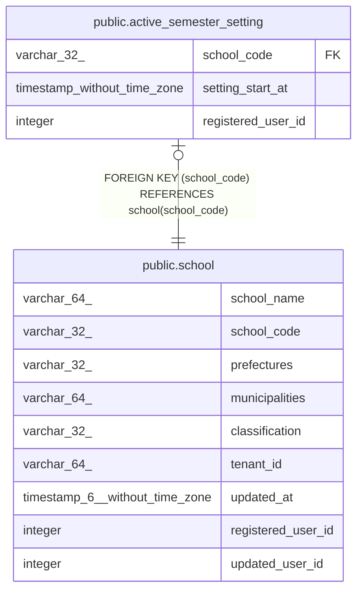

# public.active_semester_setting

## Description

期別設定中テーブル

## Columns

| Name | Type | Default | Nullable | Children | Parents | Comment |
| ---- | ---- | ------- | -------- | -------- | ------- | ------- |
| school_code | varchar(32) |  | false |  | [public.school](public.school.md) | 学校コード |
| setting_start_at | timestamp without time zone | CURRENT_TIMESTAMP | false |  |  | 期別設定開始日時 |
| registered_user_id | integer |  | false |  |  | 登録ユーザID |

## Constraints

| Name | Type | Definition |
| ---- | ---- | ---------- |
| active_semester_setting_pkey | PRIMARY KEY | PRIMARY KEY (school_code) |
| active_semester_setting_fk1 | FOREIGN KEY | FOREIGN KEY (school_code) REFERENCES school(school_code) |

## Indexes

| Name | Definition |
| ---- | ---------- |
| active_semester_setting_pkey | CREATE UNIQUE INDEX active_semester_setting_pkey ON public.active_semester_setting USING btree (school_code) |

## Relations

---

> Generated by [tbls](https://github.com/k1LoW/tbls)
