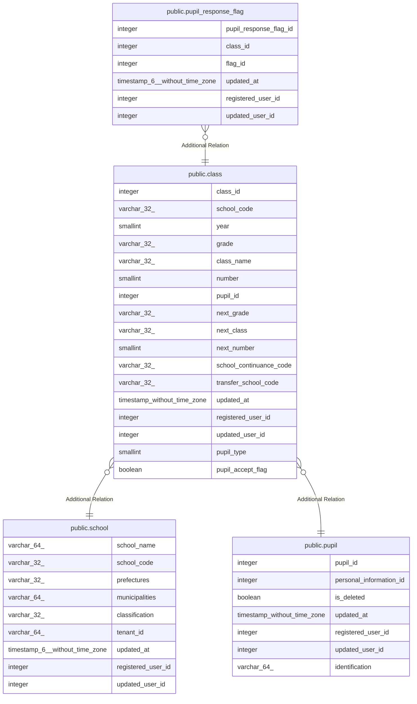

# public.class

## Description

学級テーブル

## Columns

| Name | Type | Default | Nullable | Children | Parents | Comment |
| ---- | ---- | ------- | -------- | -------- | ------- | ------- |
| class_id | integer | nextval('class_class_id_seq'::regclass) | false | [public.pupil_response_flag](public.pupil_response_flag.md) |  | クラスID |
| school_code | varchar(32) |  | false |  | [public.school](public.school.md) | 学校コード |
| year | smallint |  | false |  |  | 年度 |
| grade | varchar(32) |  | false |  |  | 学年 |
| class_name | varchar(32) |  | false |  |  | クラス名 |
| number | smallint |  | false |  |  | 出席番号 |
| pupil_id | integer |  | false |  | [public.pupil](public.pupil.md) | 児童生徒ID |
| next_grade | varchar(32) |  | true |  |  | 次学年 |
| next_class | varchar(32) |  | true |  |  | 次クラス |
| next_number | smallint |  | true |  |  | 次出席番号 |
| school_continuance_code | varchar(32) |  | true |  |  | 進学先学校コード |
| transfer_school_code | varchar(32) |  | true |  |  | 転校先学校コード |
| updated_at | timestamp without time zone |  | false |  |  | 更新日時 |
| registered_user_id | integer |  | false |  |  | 登録ユーザID |
| updated_user_id | integer |  | true |  |  | 更新ユーザID |
| pupil_type | smallint |  | true |  |  | 児童生徒種別 |
| pupil_accept_flag | boolean |  | true |  |  | 児童生徒受入済フラグ |

## Constraints

| Name | Type | Definition |
| ---- | ---- | ---------- |
| class_pkc | PRIMARY KEY | PRIMARY KEY (class_id) |

## Indexes

| Name | Definition |
| ---- | ---------- |
| class_pkc | CREATE UNIQUE INDEX class_pkc ON public.class USING btree (class_id) |

## Relations

---

> Generated by [tbls](https://github.com/k1LoW/tbls)
