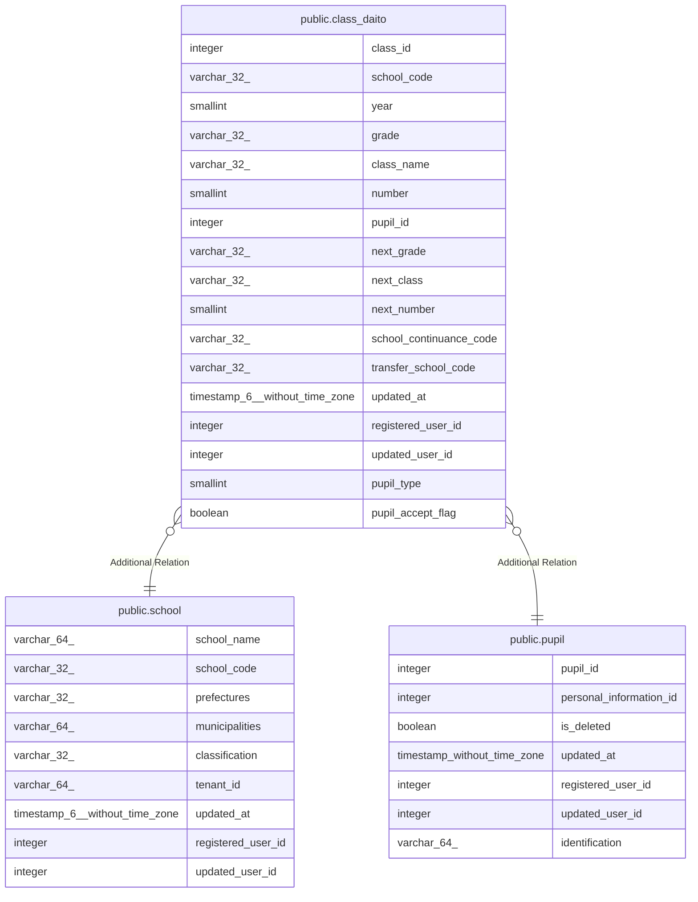

# public.class_daito

## Columns

| Name | Type | Default | Nullable | Children | Parents | Comment |
| ---- | ---- | ------- | -------- | -------- | ------- | ------- |
| class_id | integer | nextval('class_daito_class_id_seq'::regclass) | false |  |  |  |
| school_code | varchar(32) |  | false |  | [public.school](public.school.md) |  |
| year | smallint |  | false |  |  |  |
| grade | varchar(32) |  | false |  |  |  |
| class_name | varchar(32) |  | false |  |  |  |
| number | smallint |  | false |  |  |  |
| pupil_id | integer |  | false |  | [public.pupil](public.pupil.md) |  |
| next_grade | varchar(32) |  | true |  |  |  |
| next_class | varchar(32) |  | true |  |  |  |
| next_number | smallint |  | true |  |  |  |
| school_continuance_code | varchar(32) |  | true |  |  |  |
| transfer_school_code | varchar(32) |  | true |  |  |  |
| updated_at | timestamp(6) without time zone |  | false |  |  |  |
| registered_user_id | integer |  | false |  |  |  |
| updated_user_id | integer |  | true |  |  |  |
| pupil_type | smallint |  | true |  |  |  |
| pupil_accept_flag | boolean |  | true |  |  |  |

## Constraints

| Name | Type | Definition |
| ---- | ---- | ---------- |
| class_daito_pkey | PRIMARY KEY | PRIMARY KEY (class_id) |

## Indexes

| Name | Definition |
| ---- | ---------- |
| class_daito_pkey | CREATE UNIQUE INDEX class_daito_pkey ON public.class_daito USING btree (class_id) |

## Relations

---

> Generated by [tbls](https://github.com/k1LoW/tbls)
