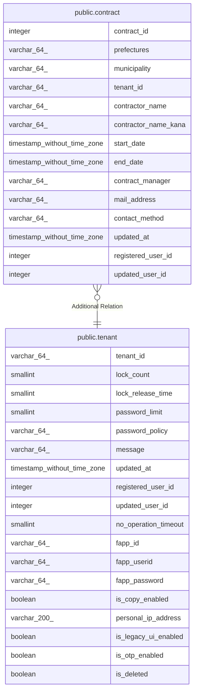

# public.contract

## Description

契約テーブル

## Columns

| Name | Type | Default | Nullable | Children | Parents | Comment |
| ---- | ---- | ------- | -------- | -------- | ------- | ------- |
| contract_id | integer | nextval('contract_contract_id_seq'::regclass) | false |  |  | 契約ID |
| prefectures | varchar(64) |  | false |  |  | 都道府県名 |
| municipality | varchar(64) |  | false |  |  | 自治体名 |
| tenant_id | varchar(64) |  | false |  | [public.tenant](public.tenant.md) | テナントID |
| contractor_name | varchar(64) |  | false |  |  | 契約者名 |
| contractor_name_kana | varchar(64) |  | true |  |  | 契約者名かな |
| start_date | timestamp without time zone |  | true |  |  | 利用開始日 |
| end_date | timestamp without time zone |  | true |  |  | 利用終了日 |
| contract_manager | varchar(64) |  | true |  |  | 契約担当者 |
| mail_address | varchar(64) |  | true |  |  | 契約担当者メールアドレス |
| contact_method | varchar(64) |  | true |  |  | 契約担当者連絡方法 |
| updated_at | timestamp without time zone |  | false |  |  | 更新日時 |
| registered_user_id | integer |  | false |  |  | 登録ユーザID |
| updated_user_id | integer |  | true |  |  | 更新ユーザID |

## Constraints

| Name | Type | Definition |
| ---- | ---- | ---------- |
| contract_pkc | PRIMARY KEY | PRIMARY KEY (contract_id) |

## Indexes

| Name | Definition |
| ---- | ---------- |
| contract_pkc | CREATE UNIQUE INDEX contract_pkc ON public.contract USING btree (contract_id) |
| contract_ix1 | CREATE UNIQUE INDEX contract_ix1 ON public.contract USING btree (tenant_id) |

## Relations

---

> Generated by [tbls](https://github.com/k1LoW/tbls)
