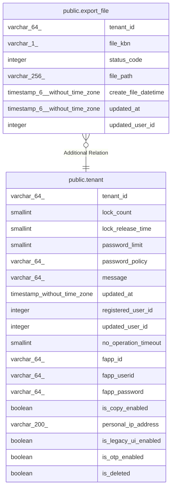

# public.export_file

## Description

エクスポートファイル

## Columns

| Name | Type | Default | Nullable | Children | Parents | Comment |
| ---- | ---- | ------- | -------- | -------- | ------- | ------- |
| tenant_id | varchar(64) |  | false |  | [public.tenant](public.tenant.md) | テナントID |
| file_kbn | varchar(1) |  | false |  |  | ファイル区分:1:スクリーニングCSV |
| status_code | integer |  | false |  |  | 状態コード:0=未作成、1=実行指示、2=作成中、3=作成済み、10=作成エラー |
| file_path | varchar(256) |  | true |  |  | ファイルパス |
| create_file_datetime | timestamp(6) without time zone |  | true |  |  | ファイル作成日時 |
| updated_at | timestamp(6) without time zone |  | false |  |  | 更新日時 |
| updated_user_id | integer |  | true |  |  | 更新ユーザーID |

## Constraints

| Name | Type | Definition |
| ---- | ---- | ---------- |
| export_file_pkc | PRIMARY KEY | PRIMARY KEY (tenant_id, file_kbn) |

## Indexes

| Name | Definition |
| ---- | ---------- |
| export_file_pkc | CREATE UNIQUE INDEX export_file_pkc ON public.export_file USING btree (tenant_id, file_kbn) |

## Relations

---

> Generated by [tbls](https://github.com/k1LoW/tbls)
