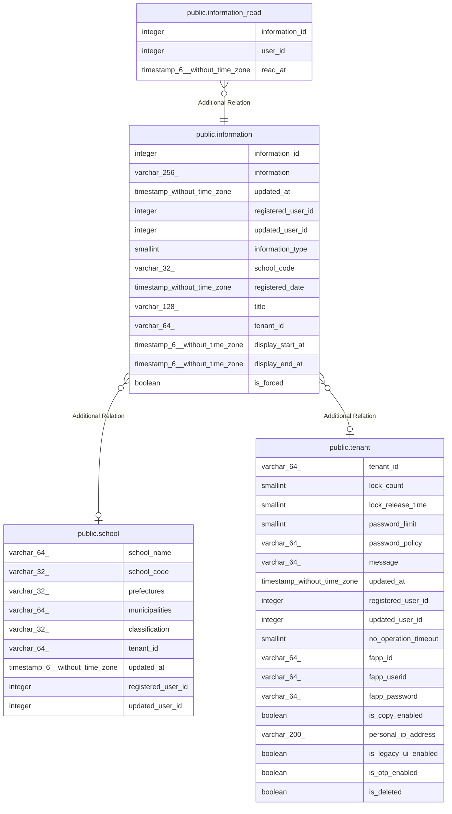

# public.information

## Description

お知らせテーブル

## Columns

| Name | Type | Default | Nullable | Children | Parents | Comment |
| ---- | ---- | ------- | -------- | -------- | ------- | ------- |
| information_id | integer | nextval('information_information_id_seq'::regclass) | false | [public.information_read](public.information_read.md) |  | お知らせID |
| information | varchar(256) |  | true |  |  | お知らせ内容 |
| updated_at | timestamp without time zone |  | false |  |  | 更新日時 |
| registered_user_id | integer |  | false |  |  | 登録ユーザID |
| updated_user_id | integer |  | true |  |  | 更新ユーザID |
| information_type | smallint |  | true |  |  | お知らせ種別 |
| school_code | varchar(32) |  | true |  | [public.school](public.school.md) | 学校コード |
| registered_date | timestamp without time zone |  | true |  |  | 登録日付 |
| title | varchar(128) |  | true |  |  |  |
| tenant_id | varchar(64) |  | true |  | [public.tenant](public.tenant.md) |  |
| display_start_at | timestamp(6) without time zone |  | true |  |  |  |
| display_end_at | timestamp(6) without time zone |  | true |  |  |  |
| is_forced | boolean | false | false |  |  |  |

## Constraints

| Name | Type | Definition |
| ---- | ---- | ---------- |
| information_pkc | PRIMARY KEY | PRIMARY KEY (information_id) |

## Indexes

| Name | Definition |
| ---- | ---------- |
| information_pkc | CREATE UNIQUE INDEX information_pkc ON public.information USING btree (information_id) |
| information_type_idx | CREATE INDEX information_type_idx ON public.information USING btree (information_type) |

## Relations

---

> Generated by [tbls](https://github.com/k1LoW/tbls)
