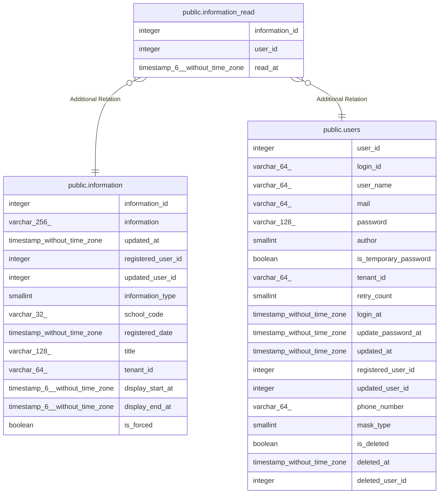

# public.information_read

## Columns

| Name | Type | Default | Nullable | Children | Parents | Comment |
| ---- | ---- | ------- | -------- | -------- | ------- | ------- |
| information_id | integer |  | false |  | [public.information](public.information.md) |  |
| user_id | integer |  | false |  | [public.users](public.users.md) |  |
| read_at | timestamp(6) without time zone |  | false |  |  |  |

## Constraints

| Name | Type | Definition |
| ---- | ---- | ---------- |
| information_read_pkey | PRIMARY KEY | PRIMARY KEY (information_id, user_id) |

## Indexes

| Name | Definition |
| ---- | ---------- |
| information_read_pkey | CREATE UNIQUE INDEX information_read_pkey ON public.information_read USING btree (information_id, user_id) |
| information_read_user_idx | CREATE INDEX information_read_user_idx ON public.information_read USING btree (user_id) |

## Relations

---

> Generated by [tbls](https://github.com/k1LoW/tbls)
