# public.m_facility_group

## Description

施設区分マスタ

## Columns

| Name | Type | Default | Nullable | Children | Parents | Comment |
| ---- | ---- | ------- | -------- | -------- | ------- | ------- |
| facility_group_code | integer |  | false | [public.m_region_resource](public.m_region_resource.md) |  | 施設区分コード |
| facility_group | varchar(16) |  | false |  |  | 施設区分 |
| registered_at | timestamp(6) without time zone |  | false |  |  | 登録日時 |
| updated_at | timestamp(6) without time zone |  | true |  |  | 更新日時 |
| registered_user_id | integer |  | false |  |  | 登録ユーザーID |
| updated_user_id | integer |  | true |  |  | 更新ユーザーID |

## Constraints

| Name | Type | Definition |
| ---- | ---- | ---------- |
| m_facility_group_pkc | PRIMARY KEY | PRIMARY KEY (facility_group_code) |

## Indexes

| Name | Definition |
| ---- | ---------- |
| m_facility_group_pkc | CREATE UNIQUE INDEX m_facility_group_pkc ON public.m_facility_group USING btree (facility_group_code) |

## Relations

```mermaid
erDiagram

"public.m_region_resource" }o--o| "public.m_facility_group" : "Additional Relation"

"public.m_facility_group" {
  integer facility_group_code
  varchar_16_ facility_group
  timestamp_6__without_time_zone registered_at
  timestamp_6__without_time_zone updated_at
  integer registered_user_id
  integer updated_user_id
}
"public.m_region_resource" {
  integer region_resource_id
  varchar_1_ end_flag
  varchar_1_ pause_flag
  varchar_64_ region_resource_name
  integer facility_group_code
  varchar_256_ facility_explanation
  varchar_16_ facility_tel1
  varchar_16_ facility_tel2
  varchar_10_ facility_post_code
  varchar_128_ facility_address
  varchar_64_ facility_email
  varchar_128_ facility_url
  integer facility_capacity
  integer facility_price
  time_without_time_zone facility_starttime
  time_without_time_zone facility_endtime
  varchar_32_ facility_close
  varchar_256_ facility_remark
  varchar_1_ infrant
  varchar_1_ student
  varchar_1_ jstudent
  varchar_1_ hstudent
  varchar_1_ anyone
  varchar_1_ parents
  varchar_1_ support_a1
  varchar_1_ support_a2
  varchar_1_ support_a3
  varchar_1_ support_a4
  varchar_1_ support_a5
  varchar_1_ support_a6
  varchar_1_ support_a7
  varchar_1_ support_a8
  varchar_1_ support_b1
  varchar_1_ support_b2
  varchar_1_ support_b3
  varchar_1_ support_b4
  varchar_1_ support_b5
  varchar_1_ support_b6
  varchar_1_ support_b7
  varchar_1_ support_b8
  varchar_1_ support_c1
  varchar_1_ support_c2
  varchar_1_ support_c3
  varchar_1_ support_c4
  varchar_1_ support_c5
  varchar_64_ organization_name
  varchar_32_ organization_representative
  varchar_16_ organization_tel1
  varchar_16_ organization_tel2
  varchar_10_ organization_post_code
  varchar_128_ organization_address
  varchar_64_ organization_email
  varchar_128_ organization_url
  varchar_256_ organization_remark
  varchar_64_ prefectures
  timestamp_6__without_time_zone registered_at
  varchar_64_ registered_tenant_id
  integer registered_user_id
  timestamp_6__without_time_zone updated_at
  varchar_32_ updated_tenant_id
  integer updated_user_id
}
```

---

> Generated by [tbls](https://github.com/k1LoW/tbls)
