# public.m_region_resource

## Description

地域資源マスタ

## Columns

| Name | Type | Default | Nullable | Children | Parents | Comment |
| ---- | ---- | ------- | -------- | -------- | ------- | ------- |
| region_resource_id | integer | nextval('m_region_resource_region_resource_id_seq'::regclass) | false |  |  | 施設コード |
| end_flag | varchar(1) |  | true |  |  | 終了フラグ:地域資源のサービス終了する場合、このフラグをＯＮにする。 |
| pause_flag | varchar(1) |  | true |  |  | 利用停止フラグ:運用者の都合により、一時的にこの地域資源が利用出来ない事を示す。 |
| region_resource_name | varchar(64) |  | false |  |  | 施設名:施設の名称 |
| facility_group_code | integer |  | true |  | [public.m_facility_group](public.m_facility_group.md) | 施設区分コード:塾、食堂、スポーツクラブ、保育施設など。 |
| facility_explanation | varchar(256) |  | true |  |  | 施設の説明:どのような施設かの説明 |
| facility_tel1 | varchar(16) |  | true |  |  | 電話番号１:固定電話、携帯電話など　２つまで登録 |
| facility_tel2 | varchar(16) |  | true |  |  | 電話番号２ |
| facility_post_code | varchar(10) |  | true |  |  | 郵便番号:郵便番号 |
| facility_address | varchar(128) |  | false |  |  | 住所:施設の住所　都道府県、市町村などを設定 |
| facility_email | varchar(64) |  | true |  |  | E-mail:メールアドレス |
| facility_url | varchar(128) |  | true |  |  | ホームページ:施設のホームページURL |
| facility_capacity | integer |  | true |  |  | 定員:施設の収容人数 |
| facility_price | integer |  | true |  |  | 料金:有料／無料　参考価格を入力 |
| facility_starttime | time without time zone |  | true |  |  | 営業時間（開始）:開始時刻 |
| facility_endtime | time without time zone |  | true |  |  | 営業時間（終了）:終了時刻 |
| facility_close | varchar(32) |  | true |  |  | 定休日:自由記述で記載（不定期、土日祝、月水、無休など） |
| facility_remark | varchar(256) |  | true |  |  | 施設の説明:どのような施設かの説明 |
| infrant | varchar(1) |  | true |  |  | 利用対象者（幼児）:利用対象者（幼児） |
| student | varchar(1) |  | true |  |  | 利用対象者（小学校）:利用対象者（小学校） |
| jstudent | varchar(1) |  | true |  |  | 利用対象者（中学校）:利用対象者（中学校） |
| hstudent | varchar(1) |  | true |  |  | 利用対象者（高校）:利用対象者（高校） |
| anyone | varchar(1) |  | true |  |  | 利用対象者（フリー）:利用対象者（フリー） |
| parents | varchar(1) |  | true |  |  | 保護者利用:保護者も利用可能かのフラグ |
| support_a1 | varchar(1) |  | true |  |  | 運用支援ランクA_1:①担任 |
| support_a2 | varchar(1) |  | true |  |  | 運用支援ランクA_2:②生徒指導や支援 |
| support_a3 | varchar(1) |  | true |  |  | 運用支援ランクA_3:③養護教諭 |
| support_a4 | varchar(1) |  | true |  |  | 運用支援ランクA_4:④特別支援担当 |
| support_a5 | varchar(1) |  | true |  |  | 運用支援ランクA_5:⑤学年団 |
| support_a6 | varchar(1) |  | true |  |  | 運用支援ランクA_6:⑥SSWを活用 |
| support_a7 | varchar(1) |  | true |  |  | 運用支援ランクA_7:⑦SCを活用 |
| support_a8 | varchar(1) |  | true |  |  | 運用支援ランクA_8:⑧その他 |
| support_b1 | varchar(1) |  | true |  |  | 運用支援ランクB_1:①家庭養育支援 |
| support_b2 | varchar(1) |  | true |  |  | 運用支援ランクB_2:②学習支援 |
| support_b3 | varchar(1) |  | true |  |  | 運用支援ランクB_3:③居場所・子ども食堂等 |
| support_b4 | varchar(1) |  | true |  |  | 運用支援ランクB_4:④単発の事業 |
| support_b5 | varchar(1) |  | true |  |  | 運用支援ランクB_5:⑤地域人材 |
| support_b6 | varchar(1) |  | true |  |  | 運用支援ランクB_6:⑥学童保育 |
| support_b7 | varchar(1) |  | true |  |  | 運用支援ランクB_7:⑦地域の福祉サービス |
| support_b8 | varchar(1) |  | true |  |  | 運用支援ランクB_8:⑧その他 |
| support_c1 | varchar(1) |  | true |  |  | 運用支援ランクC_1:①家庭児童相談・児相 |
| support_c2 | varchar(1) |  | true |  |  | 運用支援ランクC_2:②少年サポートセンター |
| support_c3 | varchar(1) |  | true |  |  | 運用支援ランクC_3:③教育センター |
| support_c4 | varchar(1) |  | true |  |  | 運用支援ランクC_4:④福祉制度 |
| support_c5 | varchar(1) |  | true |  |  | 運用支援ランクC_5:⑤その他 |
| organization_name | varchar(64) |  | true |  |  | 運営会社:施設を管理する運営会社又は団体 |
| organization_representative | varchar(32) |  | true |  |  | 運営会社　氏名:代表者氏名 |
| organization_tel1 | varchar(16) |  | true |  |  | 運営会社　電話１:電話番号　２つまで登録 |
| organization_tel2 | varchar(16) |  | true |  |  | 運営会社　電話２:電話番号　２つまで登録 |
| organization_post_code | varchar(10) |  | true |  |  | 運営会社　郵便番号:郵便番号 |
| organization_address | varchar(128) |  | true |  |  | 運営会社　住所:運営会社の住所 |
| organization_email | varchar(64) |  | true |  |  | 運営会社　E-mail:メールアドレス |
| organization_url | varchar(128) |  | true |  |  | 運営会社　URL:ホームページなど |
| organization_remark | varchar(256) |  | true |  |  | 運営会社　備考欄:コメント。自由記述 |
| prefectures | varchar(64) |  | true |  |  | 提供都道府県名:地域情報登録時に、登録したテナントに紐づく地域（都道府県）を設定 |
| registered_at | timestamp(6) without time zone |  | false |  |  | 登録日時 |
| registered_tenant_id | varchar(64) |  | false |  |  | 登録テナント:登録テナントID |
| registered_user_id | integer |  | false |  |  | 登録者ID:この地域情報を新規登録した利用者ID |
| updated_at | timestamp(6) without time zone |  | true |  |  | 更新日時 |
| updated_tenant_id | varchar(32) |  | true |  |  | 更新テナント:更新テナントID |
| updated_user_id | integer |  | true |  |  | 更新者ID:この地域情報を最後に更新した利用者ID |

## Constraints

| Name | Type | Definition |
| ---- | ---- | ---------- |
| m_region_resource_pkc | PRIMARY KEY | PRIMARY KEY (region_resource_id) |

## Indexes

| Name | Definition |
| ---- | ---------- |
| m_region_resource_pkc | CREATE UNIQUE INDEX m_region_resource_pkc ON public.m_region_resource USING btree (region_resource_id) |

## Relations

```mermaid
erDiagram

"public.m_region_resource" }o--o| "public.m_facility_group" : "Additional Relation"

"public.m_region_resource" {
  integer region_resource_id
  varchar_1_ end_flag
  varchar_1_ pause_flag
  varchar_64_ region_resource_name
  integer facility_group_code
  varchar_256_ facility_explanation
  varchar_16_ facility_tel1
  varchar_16_ facility_tel2
  varchar_10_ facility_post_code
  varchar_128_ facility_address
  varchar_64_ facility_email
  varchar_128_ facility_url
  integer facility_capacity
  integer facility_price
  time_without_time_zone facility_starttime
  time_without_time_zone facility_endtime
  varchar_32_ facility_close
  varchar_256_ facility_remark
  varchar_1_ infrant
  varchar_1_ student
  varchar_1_ jstudent
  varchar_1_ hstudent
  varchar_1_ anyone
  varchar_1_ parents
  varchar_1_ support_a1
  varchar_1_ support_a2
  varchar_1_ support_a3
  varchar_1_ support_a4
  varchar_1_ support_a5
  varchar_1_ support_a6
  varchar_1_ support_a7
  varchar_1_ support_a8
  varchar_1_ support_b1
  varchar_1_ support_b2
  varchar_1_ support_b3
  varchar_1_ support_b4
  varchar_1_ support_b5
  varchar_1_ support_b6
  varchar_1_ support_b7
  varchar_1_ support_b8
  varchar_1_ support_c1
  varchar_1_ support_c2
  varchar_1_ support_c3
  varchar_1_ support_c4
  varchar_1_ support_c5
  varchar_64_ organization_name
  varchar_32_ organization_representative
  varchar_16_ organization_tel1
  varchar_16_ organization_tel2
  varchar_10_ organization_post_code
  varchar_128_ organization_address
  varchar_64_ organization_email
  varchar_128_ organization_url
  varchar_256_ organization_remark
  varchar_64_ prefectures
  timestamp_6__without_time_zone registered_at
  varchar_64_ registered_tenant_id
  integer registered_user_id
  timestamp_6__without_time_zone updated_at
  varchar_32_ updated_tenant_id
  integer updated_user_id
}
"public.m_facility_group" {
  integer facility_group_code
  varchar_16_ facility_group
  timestamp_6__without_time_zone registered_at
  timestamp_6__without_time_zone updated_at
  integer registered_user_id
  integer updated_user_id
}
```

---

> Generated by [tbls](https://github.com/k1LoW/tbls)
