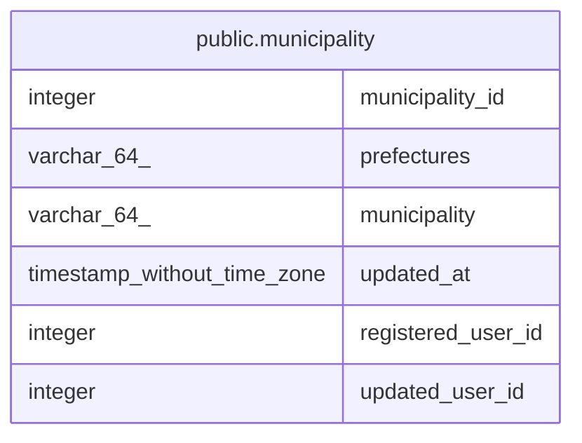

# public.municipality

## Description

自治体マスタテーブル

## Columns

| Name | Type | Default | Nullable | Children | Parents | Comment |
| ---- | ---- | ------- | -------- | -------- | ------- | ------- |
| municipality_id | integer | nextval('municipality_municipality_id_seq'::regclass) | false |  |  | 自治体ID |
| prefectures | varchar(64) |  | false |  |  | 都道府県名 |
| municipality | varchar(64) |  | false |  |  | 自治体名 |
| updated_at | timestamp without time zone |  | false |  |  | 更新日時 |
| registered_user_id | integer |  | false |  |  | 登録ユーザID |
| updated_user_id | integer |  | true |  |  | 更新ユーザID |

## Constraints

| Name | Type | Definition |
| ---- | ---- | ---------- |
| municipality_pkc | PRIMARY KEY | PRIMARY KEY (municipality_id) |

## Indexes

| Name | Definition |
| ---- | ---------- |
| municipality_pkc | CREATE UNIQUE INDEX municipality_pkc ON public.municipality USING btree (municipality_id) |

## Relations

---

> Generated by [tbls](https://github.com/k1LoW/tbls)
