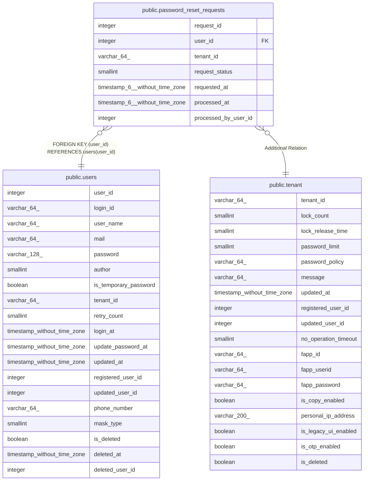

# public.password_reset_requests

## Columns

| Name | Type | Default | Nullable | Children | Parents | Comment |
| ---- | ---- | ------- | -------- | -------- | ------- | ------- |
| request_id | integer | nextval('password_reset_requests_request_id_seq'::regclass) | false |  |  |  |
| user_id | integer |  | false |  | [public.users](public.users.md) |  |
| tenant_id | varchar(64) |  | false |  | [public.tenant](public.tenant.md) |  |
| request_status | smallint | 0 | false |  |  |  |
| requested_at | timestamp(6) without time zone | CURRENT_TIMESTAMP | false |  |  |  |
| processed_at | timestamp(6) without time zone |  | true |  |  |  |
| processed_by_user_id | integer |  | true |  |  |  |

## Constraints

| Name | Type | Definition |
| ---- | ---- | ---------- |
| password_reset_requests_pkey | PRIMARY KEY | PRIMARY KEY (request_id) |
| password_reset_requests_user_id_fkey | FOREIGN KEY | FOREIGN KEY (user_id) REFERENCES users(user_id) |

## Indexes

| Name | Definition |
| ---- | ---------- |
| password_reset_requests_pkey | CREATE UNIQUE INDEX password_reset_requests_pkey ON public.password_reset_requests USING btree (request_id) |
| idx_password_reset_requests_tenant_status | CREATE INDEX idx_password_reset_requests_tenant_status ON public.password_reset_requests USING btree (tenant_id, request_status) |
| idx_password_reset_requests_user_id | CREATE INDEX idx_password_reset_requests_user_id ON public.password_reset_requests USING btree (user_id) |

## Relations

---

> Generated by [tbls](https://github.com/k1LoW/tbls)
