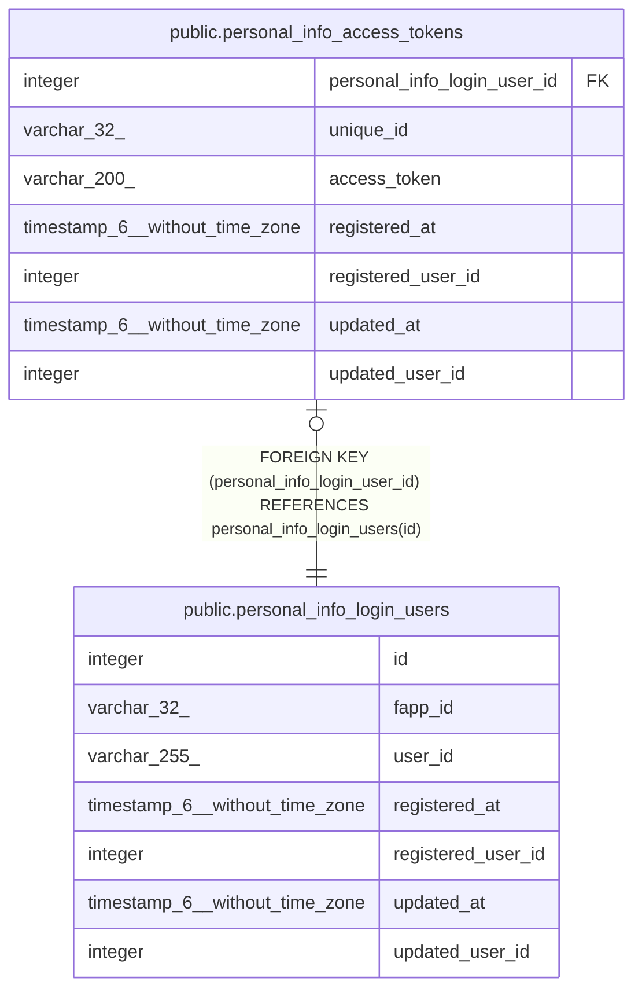

# public.personal_info_access_tokens

## Description

個人情報保管アクセストークンテーブル

## Columns

| Name | Type | Default | Nullable | Children | Parents | Comment |
| ---- | ---- | ------- | -------- | -------- | ------- | ------- |
| personal_info_login_user_id | integer |  | false |  | [public.personal_info_login_users](public.personal_info_login_users.md) | 個人情報保管ログインユーザID |
| unique_id | varchar(32) |  | false |  |  | ユニークID:個人情報保管SのAPIユーザに割り当てられるユニークID |
| access_token | varchar(200) |  | false |  |  | アクセストークン:個人情報保管Sの認証APIから取得するアクセストークン |
| registered_at | timestamp(6) without time zone | CURRENT_TIMESTAMP | false |  |  | 登録日時 |
| registered_user_id | integer |  | false |  |  | 登録ユーザID |
| updated_at | timestamp(6) without time zone |  | true |  |  | 更新日時 |
| updated_user_id | integer |  | true |  |  | 更新ユーザID |

## Constraints

| Name | Type | Definition |
| ---- | ---- | ---------- |
| personal_info_access_tokens_pkey | PRIMARY KEY | PRIMARY KEY (personal_info_login_user_id) |
| personal_info_access_tokens_personal_info_login_user_id_fkey | FOREIGN KEY | FOREIGN KEY (personal_info_login_user_id) REFERENCES personal_info_login_users(id) |

## Indexes

| Name | Definition |
| ---- | ---------- |
| personal_info_access_tokens_pkey | CREATE UNIQUE INDEX personal_info_access_tokens_pkey ON public.personal_info_access_tokens USING btree (personal_info_login_user_id) |

## Relations

---

> Generated by [tbls](https://github.com/k1LoW/tbls)
