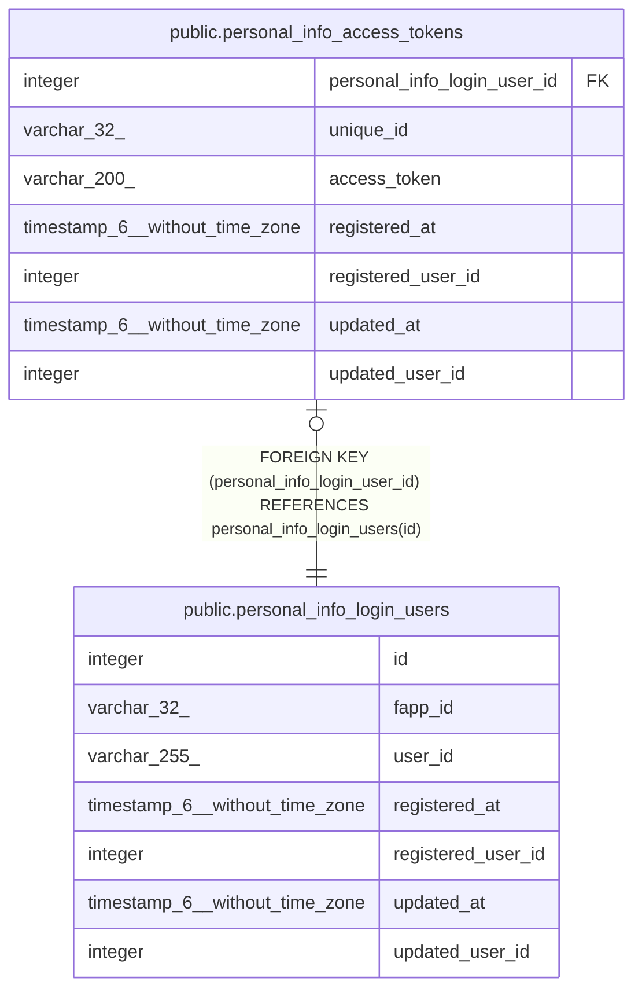

# public.personal_info_login_users

## Description

個人情報保管ログインユーザテーブル

## Columns

| Name | Type | Default | Nullable | Children | Parents | Comment |
| ---- | ---- | ------- | -------- | -------- | ------- | ------- |
| id | integer | nextval('personal_info_login_users_id_seq'::regclass) | false | [public.personal_info_access_tokens](public.personal_info_access_tokens.md) |  | 個人情報保管ログインユーザID |
| fapp_id | varchar(32) |  | false |  |  | フロントアプリID:個人情報保管Sで事前に作成したフロントアプリID |
| user_id | varchar(255) |  | false |  |  | ログインID:個人情報保管SのAPIユーザがログインする際に使用するID(メールアドレス) |
| registered_at | timestamp(6) without time zone | CURRENT_TIMESTAMP | false |  |  | 登録日時 |
| registered_user_id | integer |  | false |  |  | 登録ユーザID |
| updated_at | timestamp(6) without time zone |  | true |  |  | 更新日時 |
| updated_user_id | integer |  | true |  |  | 更新ユーザID |

## Constraints

| Name | Type | Definition |
| ---- | ---- | ---------- |
| personal_info_login_users_fapp_id_user_id_key | UNIQUE | UNIQUE (fapp_id, user_id) |
| personal_info_login_users_pkey | PRIMARY KEY | PRIMARY KEY (id) |

## Indexes

| Name | Definition |
| ---- | ---------- |
| personal_info_login_users_fapp_id_user_id_key | CREATE UNIQUE INDEX personal_info_login_users_fapp_id_user_id_key ON public.personal_info_login_users USING btree (fapp_id, user_id) |
| personal_info_login_users_pkey | CREATE UNIQUE INDEX personal_info_login_users_pkey ON public.personal_info_login_users USING btree (id) |

## Relations

---

> Generated by [tbls](https://github.com/k1LoW/tbls)
