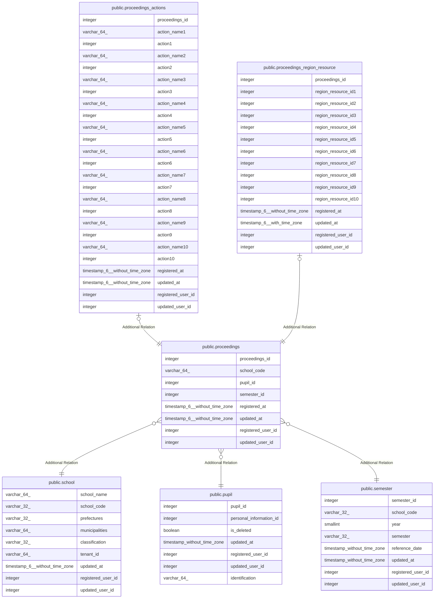

# public.proceedings

## Description

児童別議事録

## Columns

| Name | Type | Default | Nullable | Children | Parents | Comment |
| ---- | ---- | ------- | -------- | -------- | ------- | ------- |
| proceedings_id | integer | nextval('proceedings_proceedings_id_seq'::regclass) | false | [public.proceedings_actions](public.proceedings_actions.md) [public.proceedings_region_resource](public.proceedings_region_resource.md) |  | 議事録ID |
| school_code | varchar(64) |  | false |  | [public.school](public.school.md) | 学校コード |
| pupil_id | integer |  | false |  | [public.pupil](public.pupil.md) | 児童生徒ID |
| semester_id | integer |  | false |  | [public.semester](public.semester.md) | 期別ID |
| registered_at | timestamp(6) without time zone |  | false |  |  | 登録日時 |
| updated_at | timestamp(6) without time zone |  | true |  |  | 更新日時 |
| registered_user_id | integer |  | false |  |  | 登録ユーザID |
| updated_user_id | integer |  | true |  |  | 更新ユーザID |

## Constraints

| Name | Type | Definition |
| ---- | ---- | ---------- |
| proceedings_pkc | PRIMARY KEY | PRIMARY KEY (proceedings_id) |

## Indexes

| Name | Definition |
| ---- | ---------- |
| proceedings_pkc | CREATE UNIQUE INDEX proceedings_pkc ON public.proceedings USING btree (proceedings_id) |

## Relations

---

> Generated by [tbls](https://github.com/k1LoW/tbls)
