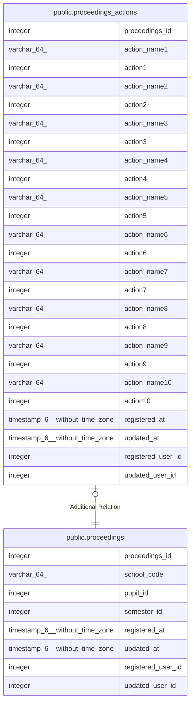

# public.proceedings_actions

## Description

議事録アクション

## Columns

| Name | Type | Default | Nullable | Children | Parents | Comment |
| ---- | ---- | ------- | -------- | -------- | ------- | ------- |
| proceedings_id | integer |  | false |  | [public.proceedings](public.proceedings.md) | 議事録ID |
| action_name1 | varchar(64) |  | true |  |  | アクション名1 |
| action1 | integer |  | true |  |  | アクション1 |
| action_name2 | varchar(64) |  | true |  |  | アクション名2 |
| action2 | integer |  | true |  |  | アクション2 |
| action_name3 | varchar(64) |  | true |  |  | アクション名3 |
| action3 | integer |  | true |  |  | アクション3 |
| action_name4 | varchar(64) |  | true |  |  | アクション名4 |
| action4 | integer |  | true |  |  | アクション4 |
| action_name5 | varchar(64) |  | true |  |  | アクション名5 |
| action5 | integer |  | true |  |  | アクション5 |
| action_name6 | varchar(64) |  | true |  |  | アクション名6 |
| action6 | integer |  | true |  |  | アクション6 |
| action_name7 | varchar(64) |  | true |  |  | アクション名7 |
| action7 | integer |  | true |  |  | アクション7 |
| action_name8 | varchar(64) |  | true |  |  | アクション名8 |
| action8 | integer |  | true |  |  | アクション8 |
| action_name9 | varchar(64) |  | true |  |  | アクション名9 |
| action9 | integer |  | true |  |  | アクション9 |
| action_name10 | varchar(64) |  | true |  |  | アクション名10 |
| action10 | integer |  | true |  |  | アクション10 |
| registered_at | timestamp(6) without time zone |  | false |  |  | 登録日時 |
| updated_at | timestamp(6) without time zone |  | true |  |  | 更新日時 |
| registered_user_id | integer |  | false |  |  | 登録ユーザID |
| updated_user_id | integer |  | true |  |  | 更新ユーザID |

## Constraints

| Name | Type | Definition |
| ---- | ---- | ---------- |
| proceedings_actions_pkc | PRIMARY KEY | PRIMARY KEY (proceedings_id) |

## Indexes

| Name | Definition |
| ---- | ---------- |
| proceedings_actions_pkc | CREATE UNIQUE INDEX proceedings_actions_pkc ON public.proceedings_actions USING btree (proceedings_id) |

## Relations

---

> Generated by [tbls](https://github.com/k1LoW/tbls)
