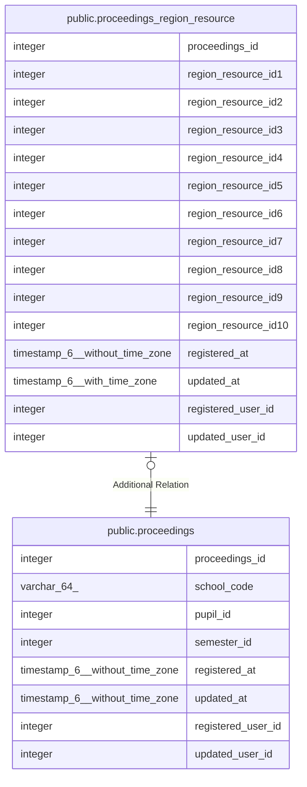

# public.proceedings_region_resource

## Description

議事録地域資源

## Columns

| Name | Type | Default | Nullable | Children | Parents | Comment |
| ---- | ---- | ------- | -------- | -------- | ------- | ------- |
| proceedings_id | integer |  | false |  | [public.proceedings](public.proceedings.md) | 議事録ID |
| region_resource_id1 | integer |  | true |  |  | 地域資源ID1 |
| region_resource_id2 | integer |  | true |  |  | 地域資源ID2 |
| region_resource_id3 | integer |  | true |  |  | 地域資源ID3 |
| region_resource_id4 | integer |  | true |  |  | 地域資源ID4 |
| region_resource_id5 | integer |  | true |  |  | 地域資源ID5 |
| region_resource_id6 | integer |  | true |  |  | 地域資源ID6 |
| region_resource_id7 | integer |  | true |  |  | 地域資源ID7 |
| region_resource_id8 | integer |  | true |  |  | 地域資源ID8 |
| region_resource_id9 | integer |  | true |  |  | 地域資源ID9 |
| region_resource_id10 | integer |  | true |  |  | 地域資源ID10 |
| registered_at | timestamp(6) without time zone |  | false |  |  | 登録日時 |
| updated_at | timestamp(6) with time zone |  | true |  |  | 更新日時 |
| registered_user_id | integer |  | false |  |  | 登録ユーザID |
| updated_user_id | integer |  | true |  |  | 更新ユーザID |

## Constraints

| Name | Type | Definition |
| ---- | ---- | ---------- |
| proceedings_region_resource_pkc | PRIMARY KEY | PRIMARY KEY (proceedings_id) |

## Indexes

| Name | Definition |
| ---- | ---------- |
| proceedings_region_resource_pkc | CREATE UNIQUE INDEX proceedings_region_resource_pkc ON public.proceedings_region_resource USING btree (proceedings_id) |

## Relations

---

> Generated by [tbls](https://github.com/k1LoW/tbls)
