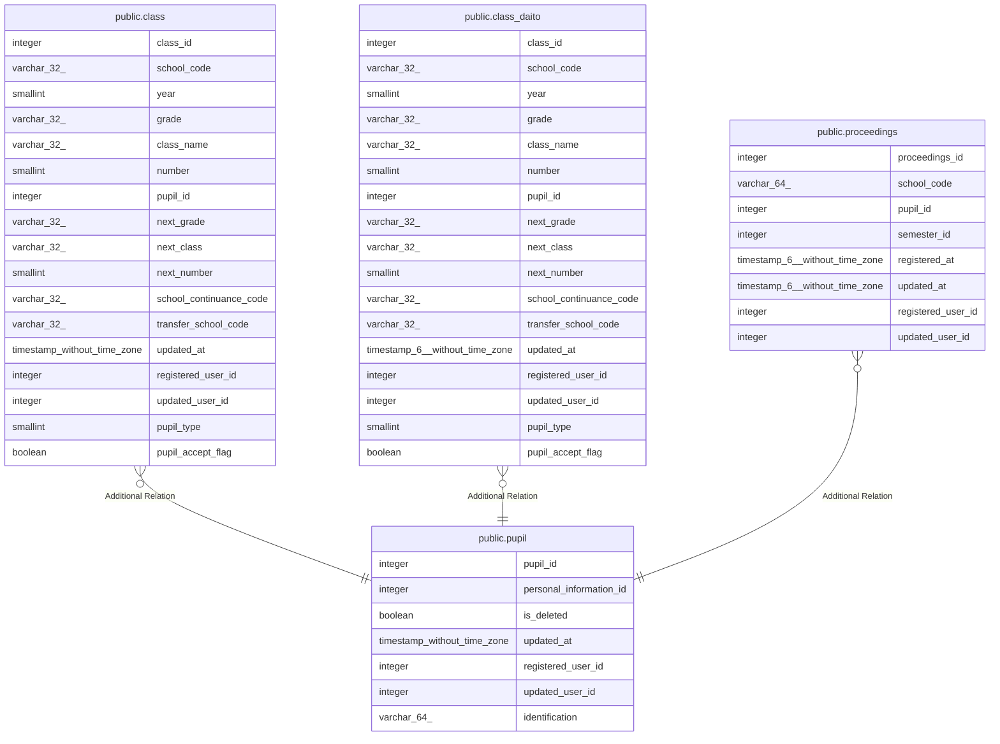

# public.pupil

## Description

児童生徒テーブル

## Columns

| Name | Type | Default | Nullable | Children | Parents | Comment |
| ---- | ---- | ------- | -------- | -------- | ------- | ------- |
| pupil_id | integer | nextval('pupil_pupil_id_seq'::regclass) | false | [public.class](public.class.md) [public.class_daito](public.class_daito.md) [public.proceedings](public.proceedings.md) |  | 児童生徒ID |
| personal_information_id | integer |  | false |  |  | 個人情報ID |
| is_deleted | boolean | false | false |  |  | 論理削除フラグ |
| updated_at | timestamp without time zone |  | false |  |  | 更新日時 |
| registered_user_id | integer |  | false |  |  | 登録ユーザID |
| updated_user_id | integer |  | true |  |  | 更新ユーザID |
| identification | varchar(64) |  | true |  |  | 識別情報 |

## Constraints

| Name | Type | Definition |
| ---- | ---- | ---------- |
| pupil_pkc | PRIMARY KEY | PRIMARY KEY (pupil_id) |

## Indexes

| Name | Definition |
| ---- | ---------- |
| pupil_pkc | CREATE UNIQUE INDEX pupil_pkc ON public.pupil USING btree (pupil_id) |

## Relations

---

> Generated by [tbls](https://github.com/k1LoW/tbls)
