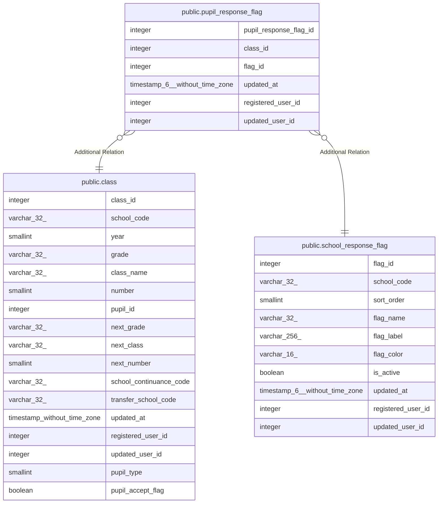

# public.pupil_response_flag

## Columns

| Name | Type | Default | Nullable | Children | Parents | Comment |
| ---- | ---- | ------- | -------- | -------- | ------- | ------- |
| pupil_response_flag_id | integer | nextval('pupil_response_flag_pupil_response_flag_id_seq'::regclass) | false |  |  |  |
| class_id | integer |  | false |  | [public.class](public.class.md) |  |
| flag_id | integer |  | false |  | [public.school_response_flag](public.school_response_flag.md) |  |
| updated_at | timestamp(6) without time zone |  | false |  |  |  |
| registered_user_id | integer |  | false |  |  |  |
| updated_user_id | integer |  | true |  |  |  |

## Constraints

| Name | Type | Definition |
| ---- | ---- | ---------- |
| pupil_response_flag_pkey | PRIMARY KEY | PRIMARY KEY (pupil_response_flag_id) |
| pupil_response_flag_uq | UNIQUE | UNIQUE (class_id, flag_id) |

## Indexes

| Name | Definition |
| ---- | ---------- |
| pupil_response_flag_pkey | CREATE UNIQUE INDEX pupil_response_flag_pkey ON public.pupil_response_flag USING btree (pupil_response_flag_id) |
| pupil_response_flag_uq | CREATE UNIQUE INDEX pupil_response_flag_uq ON public.pupil_response_flag USING btree (class_id, flag_id) |
| pupil_response_flag_ix1 | CREATE INDEX pupil_response_flag_ix1 ON public.pupil_response_flag USING btree (class_id) |
| pupil_response_flag_ix2 | CREATE INDEX pupil_response_flag_ix2 ON public.pupil_response_flag USING btree (flag_id) |

## Relations

---

> Generated by [tbls](https://github.com/k1LoW/tbls)
