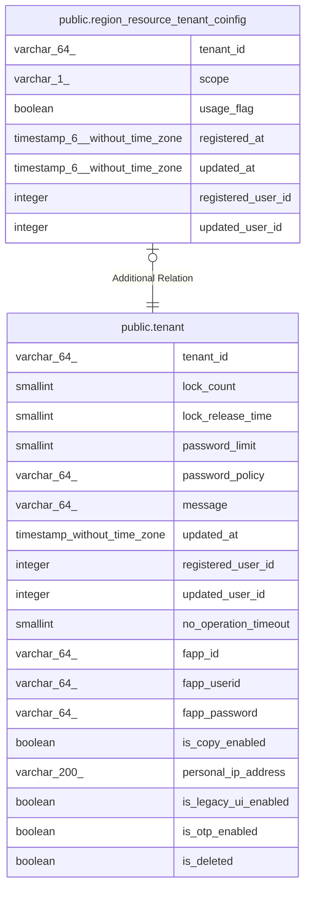

# public.region_resource_tenant_coinfig

## Description

地域資源_テナント設定

## Columns

| Name | Type | Default | Nullable | Children | Parents | Comment |
| ---- | ---- | ------- | -------- | -------- | ------- | ------- |
| tenant_id | varchar(64) |  | false |  | [public.tenant](public.tenant.md) | テナントID:YOSSで管理しているテナントID |
| scope | varchar(1) |  | false |  |  | 対象範囲:0:同一テナント、1:同一地域 |
| usage_flag | boolean |  | false |  |  | 地域資源使用フラグ:false:無効、true:有効 |
| registered_at | timestamp(6) without time zone |  | false |  |  | 登録日時 |
| updated_at | timestamp(6) without time zone |  | true |  |  | 更新日時 |
| registered_user_id | integer |  | false |  |  | 登録ユーザーID |
| updated_user_id | integer |  | true |  |  | 更新ユーザーID |

## Constraints

| Name | Type | Definition |
| ---- | ---- | ---------- |
| region_resource_tenant_coinfig_pkc | PRIMARY KEY | PRIMARY KEY (tenant_id) |

## Indexes

| Name | Definition |
| ---- | ---------- |
| region_resource_tenant_coinfig_pkc | CREATE UNIQUE INDEX region_resource_tenant_coinfig_pkc ON public.region_resource_tenant_coinfig USING btree (tenant_id) |

## Relations

---

> Generated by [tbls](https://github.com/k1LoW/tbls)
