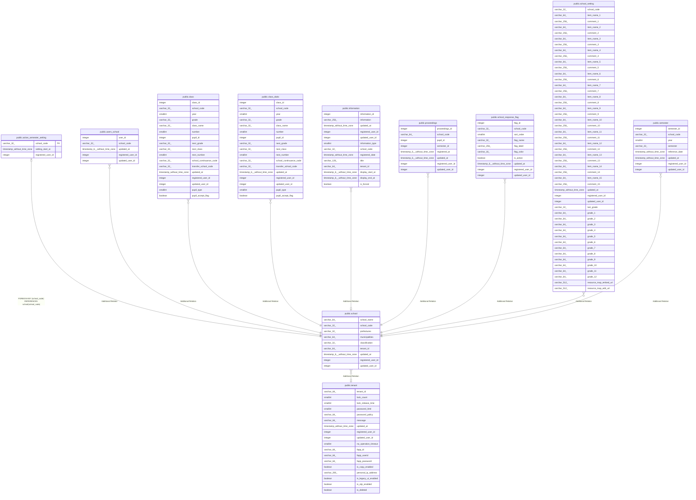

# public.school

## Description

学校テーブル

## Columns

| Name | Type | Default | Nullable | Children | Parents | Comment |
| ---- | ---- | ------- | -------- | -------- | ------- | ------- |
| school_name | varchar(64) |  | false |  |  | 学校名 |
| school_code | varchar(32) |  | false | [public.active_semester_setting](public.active_semester_setting.md) [public.users_school](public.users_school.md) [public.class](public.class.md) [public.class_daito](public.class_daito.md) [public.information](public.information.md) [public.proceedings](public.proceedings.md) [public.school_response_flag](public.school_response_flag.md) [public.school_setting](public.school_setting.md) [public.semester](public.semester.md) |  | 学校コード |
| prefectures | varchar(32) |  | false |  |  | 都道府県 |
| municipalities | varchar(64) |  | false |  |  | 市区町村 |
| classification | varchar(32) |  | false |  |  | 学校区分 |
| tenant_id | varchar(64) |  | true |  | [public.tenant](public.tenant.md) | テナントID |
| updated_at | timestamp(6) without time zone |  | true |  |  | 更新日時 |
| registered_user_id | integer |  | true |  |  | 登録ユーザID |
| updated_user_id | integer |  | true |  |  | 更新ユーザID |

## Constraints

| Name | Type | Definition |
| ---- | ---- | ---------- |
| school_pkc | PRIMARY KEY | PRIMARY KEY (school_code) |

## Indexes

| Name | Definition |
| ---- | ---------- |
| school_pkc | CREATE UNIQUE INDEX school_pkc ON public.school USING btree (school_code) |

## Relations

---

> Generated by [tbls](https://github.com/k1LoW/tbls)
