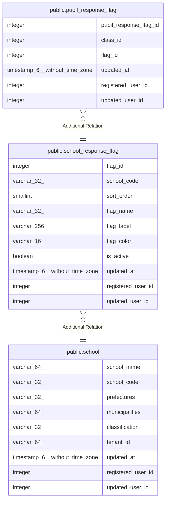

# public.school_response_flag

## Columns

| Name | Type | Default | Nullable | Children | Parents | Comment |
| ---- | ---- | ------- | -------- | -------- | ------- | ------- |
| flag_id | integer | nextval('school_response_flag_flag_id_seq'::regclass) | false | [public.pupil_response_flag](public.pupil_response_flag.md) |  |  |
| school_code | varchar(32) |  | false |  | [public.school](public.school.md) |  |
| sort_order | smallint |  | false |  |  |  |
| flag_name | varchar(32) |  | false |  |  |  |
| flag_label | varchar(256) |  | true |  |  |  |
| flag_color | varchar(16) | 'blue'::character varying | false |  |  |  |
| is_active | boolean | true | false |  |  |  |
| updated_at | timestamp(6) without time zone |  | false |  |  |  |
| registered_user_id | integer |  | false |  |  |  |
| updated_user_id | integer |  | true |  |  |  |

## Constraints

| Name | Type | Definition |
| ---- | ---- | ---------- |
| school_response_flag_pkey | PRIMARY KEY | PRIMARY KEY (flag_id) |
| school_response_flag_uq | UNIQUE | UNIQUE (school_code, sort_order) |

## Indexes

| Name | Definition |
| ---- | ---------- |
| school_response_flag_pkey | CREATE UNIQUE INDEX school_response_flag_pkey ON public.school_response_flag USING btree (flag_id) |
| school_response_flag_uq | CREATE UNIQUE INDEX school_response_flag_uq ON public.school_response_flag USING btree (school_code, sort_order) |
| school_response_flag_ix1 | CREATE INDEX school_response_flag_ix1 ON public.school_response_flag USING btree (school_code) |

## Relations

---

> Generated by [tbls](https://github.com/k1LoW/tbls)
