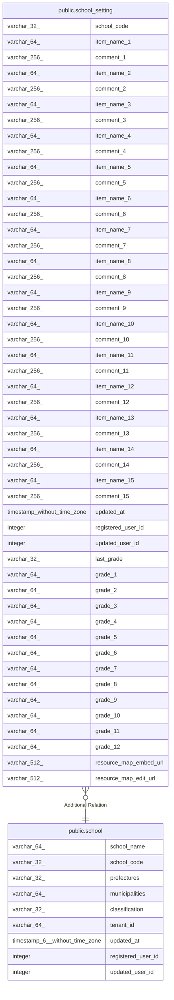

# public.school_setting

## Description

学校設定テーブル

## Columns

| Name | Type | Default | Nullable | Children | Parents | Comment |
| ---- | ---- | ------- | -------- | -------- | ------- | ------- |
| school_code | varchar(32) |  | false |  | [public.school](public.school.md) | 学校コード |
| item_name_1 | varchar(64) |  | true |  |  | 項目名1 |
| comment_1 | varchar(256) |  | true |  |  | コメント1 |
| item_name_2 | varchar(64) |  | true |  |  | 項目名2 |
| comment_2 | varchar(256) |  | true |  |  | コメント2 |
| item_name_3 | varchar(64) |  | true |  |  | 項目名3 |
| comment_3 | varchar(256) |  | true |  |  | コメント3 |
| item_name_4 | varchar(64) |  | true |  |  | 項目名4 |
| comment_4 | varchar(256) |  | true |  |  | コメント4 |
| item_name_5 | varchar(64) |  | true |  |  | 項目名5 |
| comment_5 | varchar(256) |  | true |  |  | コメント5 |
| item_name_6 | varchar(64) |  | true |  |  | 項目名6 |
| comment_6 | varchar(256) |  | true |  |  | コメント6 |
| item_name_7 | varchar(64) |  | true |  |  | 項目名7 |
| comment_7 | varchar(256) |  | true |  |  | コメント7 |
| item_name_8 | varchar(64) |  | true |  |  | 項目名8 |
| comment_8 | varchar(256) |  | true |  |  | コメント8 |
| item_name_9 | varchar(64) |  | true |  |  | 項目名9 |
| comment_9 | varchar(256) |  | true |  |  | コメント9 |
| item_name_10 | varchar(64) |  | true |  |  | 項目名10 |
| comment_10 | varchar(256) |  | true |  |  | コメント10 |
| item_name_11 | varchar(64) |  | true |  |  | 項目名11 |
| comment_11 | varchar(256) |  | true |  |  | コメント11 |
| item_name_12 | varchar(64) |  | true |  |  | 項目名12 |
| comment_12 | varchar(256) |  | true |  |  | コメント12 |
| item_name_13 | varchar(64) |  | true |  |  | 項目名13 |
| comment_13 | varchar(256) |  | true |  |  | コメント13 |
| item_name_14 | varchar(64) |  | true |  |  | 項目名14 |
| comment_14 | varchar(256) |  | true |  |  | コメント14 |
| item_name_15 | varchar(64) |  | true |  |  | 項目名15 |
| comment_15 | varchar(256) |  | true |  |  | コメント15 |
| updated_at | timestamp without time zone |  | false |  |  | 更新日時 |
| registered_user_id | integer |  | false |  |  | 登録ユーザID |
| updated_user_id | integer |  | true |  |  | 更新ユーザID |
| last_grade | varchar(32) |  | true |  |  | 最終学年 |
| grade_1 | varchar(64) | '小学1年'::character varying | true |  |  | 学年1 |
| grade_2 | varchar(64) | '小学2年'::character varying | true |  |  | 学年2 |
| grade_3 | varchar(64) | '小学3年'::character varying | true |  |  | 学年3 |
| grade_4 | varchar(64) | '小学4年'::character varying | true |  |  | 学年4 |
| grade_5 | varchar(64) | '小学5年'::character varying | true |  |  | 学年5 |
| grade_6 | varchar(64) | '小学6年'::character varying | true |  |  | 学年6 |
| grade_7 | varchar(64) | '中学1年'::character varying | true |  |  | 学年7 |
| grade_8 | varchar(64) | '中学2年'::character varying | true |  |  | 学年8 |
| grade_9 | varchar(64) | '中学3年'::character varying | true |  |  | 学年9 |
| grade_10 | varchar(64) |  | true |  |  |  |
| grade_11 | varchar(64) |  | true |  |  |  |
| grade_12 | varchar(64) |  | true |  |  |  |
| resource_map_embed_url | varchar(512) |  | true |  |  | 地域資源マップ埋め込みURL（Google Maps embed用） |
| resource_map_edit_url | varchar(512) |  | true |  |  | 地域資源マップ編集URL（Google Maps edit用） |

## Relations

---

> Generated by [tbls](https://github.com/k1LoW/tbls)
