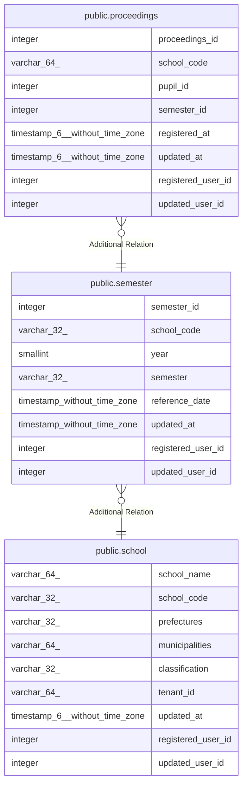

# public.semester

## Description

期別テーブル

## Columns

| Name | Type | Default | Nullable | Children | Parents | Comment |
| ---- | ---- | ------- | -------- | -------- | ------- | ------- |
| semester_id | integer | nextval('semester_semester_id_seq'::regclass) | false | [public.proceedings](public.proceedings.md) |  | 期別ID |
| school_code | varchar(32) |  | false |  | [public.school](public.school.md) | 学校コード |
| year | smallint |  | false |  |  | 年度 |
| semester | varchar(32) |  | true |  |  | 学期 |
| reference_date | timestamp without time zone |  | true |  |  | 基準日 |
| updated_at | timestamp without time zone |  | false |  |  | 更新日時 |
| registered_user_id | integer |  | false |  |  | 登録ユーザID |
| updated_user_id | integer |  | true |  |  | 更新ユーザID |

## Constraints

| Name | Type | Definition |
| ---- | ---- | ---------- |
| semester_new_pkc | PRIMARY KEY | PRIMARY KEY (semester_id) |

## Indexes

| Name | Definition |
| ---- | ---------- |
| semester_new_pkc | CREATE UNIQUE INDEX semester_new_pkc ON public.semester USING btree (semester_id) |

## Relations

---

> Generated by [tbls](https://github.com/k1LoW/tbls)
