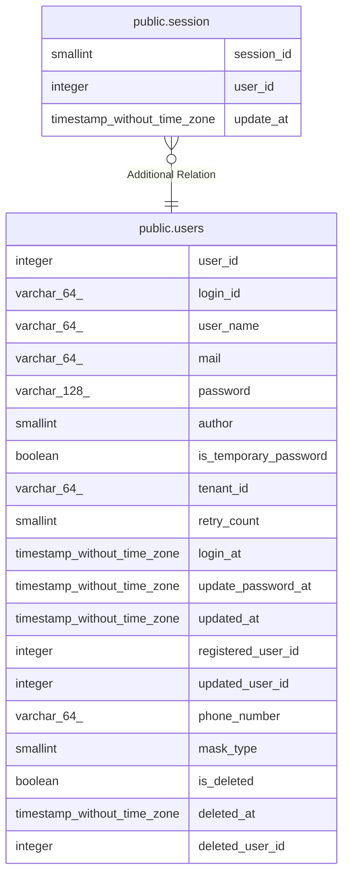

# public.session

## Description

セッションテーブル

## Columns

| Name | Type | Default | Nullable | Children | Parents | Comment |
| ---- | ---- | ------- | -------- | -------- | ------- | ------- |
| session_id | smallint |  | false |  |  | セッションID |
| user_id | integer |  | false |  | [public.users](public.users.md) | ユーザID |
| update_at | timestamp without time zone |  | false |  |  | 更新日時 |

## Relations

---

> Generated by [tbls](https://github.com/k1LoW/tbls)
