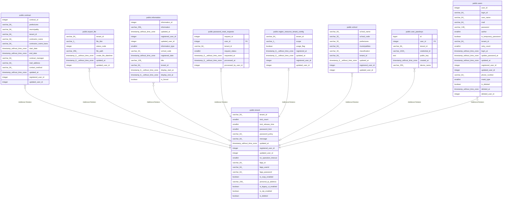

# public.tenant

## Description

テナントテーブル

## Columns

| Name | Type | Default | Nullable | Children | Parents | Comment |
| ---- | ---- | ------- | -------- | -------- | ------- | ------- |
| tenant_id | varchar(64) |  | false | [public.contract](public.contract.md) [public.export_file](public.export_file.md) [public.information](public.information.md) [public.password_reset_requests](public.password_reset_requests.md) [public.region_resource_tenant_coinfig](public.region_resource_tenant_coinfig.md) [public.school](public.school.md) [public.user_passkeys](public.user_passkeys.md) [public.users](public.users.md) |  | テナントID |
| lock_count | smallint |  | true |  |  | ロック回数 |
| lock_release_time | smallint |  | true |  |  | ロック解除時間 |
| password_limit | smallint |  | true |  |  | パスワード有効期限 |
| password_policy | varchar(64) |  | true |  |  | パスワードポリシー |
| message | varchar(64) |  | true |  |  | エラーメッセージ |
| updated_at | timestamp without time zone |  | false |  |  | 更新日時 |
| registered_user_id | integer |  | false |  |  | 登録ユーザID |
| updated_user_id | integer |  | true |  |  | 更新ユーザID |
| no_operation_timeout | smallint |  | true |  |  | 無操作タイムアウト時間 |
| fapp_id | varchar(64) |  | true |  |  | フロントアプリID |
| fapp_userid | varchar(64) |  | true |  |  | フロントアプリユーザID |
| fapp_password | varchar(64) |  | true |  |  | フロントアプリパスワード |
| is_copy_enabled | boolean | false | true |  |  | コピー機能有効化 |
| personal_ip_address | varchar(200) |  | true |  |  | 個人情報保管IPアドレス |
| is_legacy_ui_enabled | boolean | false | true |  |  |  |
| is_otp_enabled | boolean | false | true |  |  |  |
| is_deleted | boolean | false | false |  |  |  |

## Constraints

| Name | Type | Definition |
| ---- | ---- | ---------- |
| tenanto_pkc | PRIMARY KEY | PRIMARY KEY (tenant_id) |

## Indexes

| Name | Definition |
| ---- | ---------- |
| tenanto_pkc | CREATE UNIQUE INDEX tenanto_pkc ON public.tenant USING btree (tenant_id) |

## Relations

---

> Generated by [tbls](https://github.com/k1LoW/tbls)
