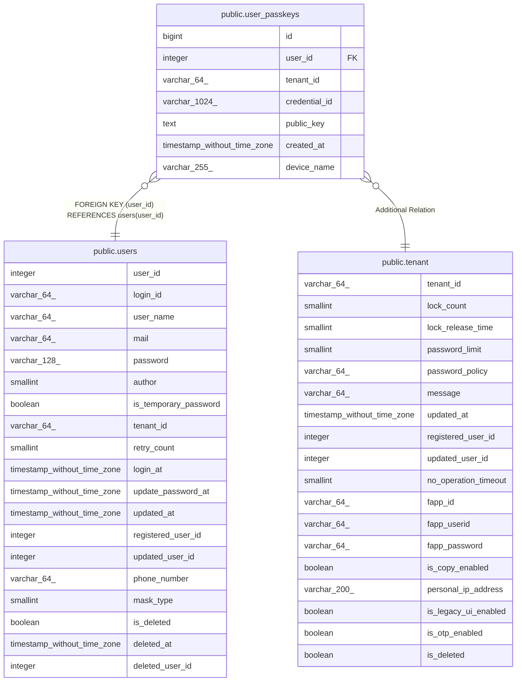

# public.user_passkeys

## Columns

| Name | Type | Default | Nullable | Children | Parents | Comment |
| ---- | ---- | ------- | -------- | -------- | ------- | ------- |
| id | bigint | nextval('user_passkeys_id_seq1'::regclass) | false |  |  |  |
| user_id | integer |  | false |  | [public.users](public.users.md) |  |
| tenant_id | varchar(64) |  | false |  | [public.tenant](public.tenant.md) |  |
| credential_id | varchar(1024) |  | false |  |  |  |
| public_key | text |  | false |  |  |  |
| created_at | timestamp without time zone | CURRENT_TIMESTAMP | false |  |  |  |
| device_name | varchar(255) | NULL::character varying | true |  |  |  |

## Constraints

| Name | Type | Definition |
| ---- | ---- | ---------- |
| user_passkeys_credential_id_key | UNIQUE | UNIQUE (credential_id) |
| user_passkeys_pkey | PRIMARY KEY | PRIMARY KEY (id) |
| fk_user_passkeys_user | FOREIGN KEY | FOREIGN KEY (user_id) REFERENCES users(user_id) |

## Indexes

| Name | Definition |
| ---- | ---------- |
| user_passkeys_credential_id_key | CREATE UNIQUE INDEX user_passkeys_credential_id_key ON public.user_passkeys USING btree (credential_id) |
| user_passkeys_pkey | CREATE UNIQUE INDEX user_passkeys_pkey ON public.user_passkeys USING btree (id) |
| idx_user_passkeys_credential_id | CREATE INDEX idx_user_passkeys_credential_id ON public.user_passkeys USING btree (credential_id) |
| idx_user_passkeys_user_tenant | CREATE INDEX idx_user_passkeys_user_tenant ON public.user_passkeys USING btree (user_id, tenant_id) |

## Relations

---

> Generated by [tbls](https://github.com/k1LoW/tbls)
