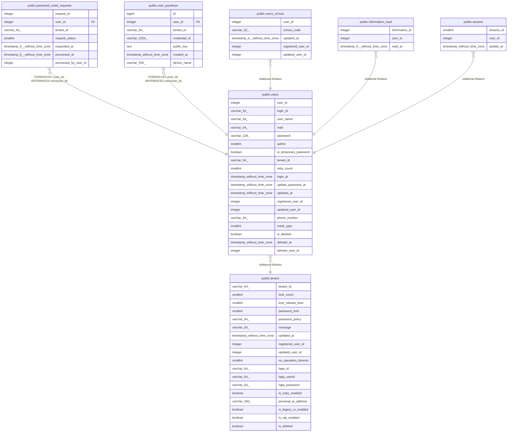

# public.users

## Description

ユーザテーブル

## Columns

| Name | Type | Default | Nullable | Children | Parents | Comment |
| ---- | ---- | ------- | -------- | -------- | ------- | ------- |
| user_id | integer | nextval('users_user_id_seq'::regclass) | false | [public.password_reset_requests](public.password_reset_requests.md) [public.user_passkeys](public.user_passkeys.md) [public.users_school](public.users_school.md) [public.information_read](public.information_read.md) [public.session](public.session.md) |  | ユーザID |
| login_id | varchar(64) |  | false |  |  | ログインID |
| user_name | varchar(64) |  | false |  |  | ログインユーザ名 |
| mail | varchar(64) |  | true |  |  | メールアドレス |
| password | varchar(128) |  | false |  |  | パスワード |
| author | smallint |  | false |  |  | 権限 |
| is_temporary_password | boolean | false | true |  |  | 仮パスワードフラグ |
| tenant_id | varchar(64) |  | false |  | [public.tenant](public.tenant.md) | テナントID |
| retry_count | smallint |  | true |  |  | ログイン失敗回数 |
| login_at | timestamp without time zone |  | true |  |  | ログイン日時 |
| update_password_at | timestamp without time zone |  | true |  |  | パスワード更新日付 |
| updated_at | timestamp without time zone |  | false |  |  | 更新日時 |
| registered_user_id | integer |  | false |  |  | 登録ユーザID |
| updated_user_id | integer |  | true |  |  | 更新ユーザID |
| phone_number | varchar(64) |  | true |  |  | 連絡先 |
| mask_type | smallint |  | true |  |  | 個人情報マスク種別: 0=マスクなし, 1=常時マスク(解除不可), 2=マスクあり(限定解除可能) |
| is_deleted | boolean | false | false |  |  |  |
| deleted_at | timestamp without time zone |  | true |  |  |  |
| deleted_user_id | integer |  | true |  |  |  |

## Constraints

| Name | Type | Definition |
| ---- | ---- | ---------- |
| users_pkc | PRIMARY KEY | PRIMARY KEY (user_id) |

## Indexes

| Name | Definition |
| ---- | ---------- |
| users_pkc | CREATE UNIQUE INDEX users_pkc ON public.users USING btree (user_id) |
| idx_users_is_deleted | CREATE INDEX idx_users_is_deleted ON public.users USING btree (is_deleted) |

## Relations

---

> Generated by [tbls](https://github.com/k1LoW/tbls)
