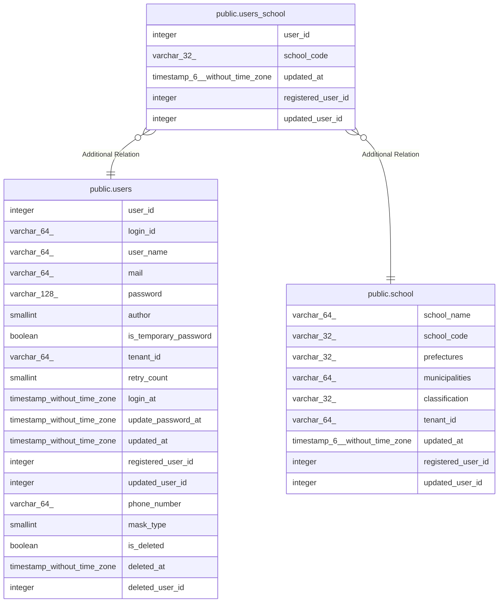

# public.users_school

## Description

ユーザ所属学校テーブル

## Columns

| Name | Type | Default | Nullable | Children | Parents | Comment |
| ---- | ---- | ------- | -------- | -------- | ------- | ------- |
| user_id | integer | nextval('"$$users_school_user_id_seq"'::regclass) | false |  | [public.users](public.users.md) | ユーザID |
| school_code | varchar(32) |  | false |  | [public.school](public.school.md) | 学校コード |
| updated_at | timestamp(6) without time zone |  | false |  |  | 更新日時 |
| registered_user_id | integer |  | false |  |  | 登録ユーザID |
| updated_user_id | integer |  | true |  |  | 更新ユーザID |

## Constraints

| Name | Type | Definition |
| ---- | ---- | ---------- |
| users_school_pkc | PRIMARY KEY | PRIMARY KEY (user_id, school_code) |

## Indexes

| Name | Definition |
| ---- | ---------- |
| users_school_pkc | CREATE UNIQUE INDEX users_school_pkc ON public.users_school USING btree (user_id, school_code) |

## Relations

---

> Generated by [tbls](https://github.com/k1LoW/tbls)
