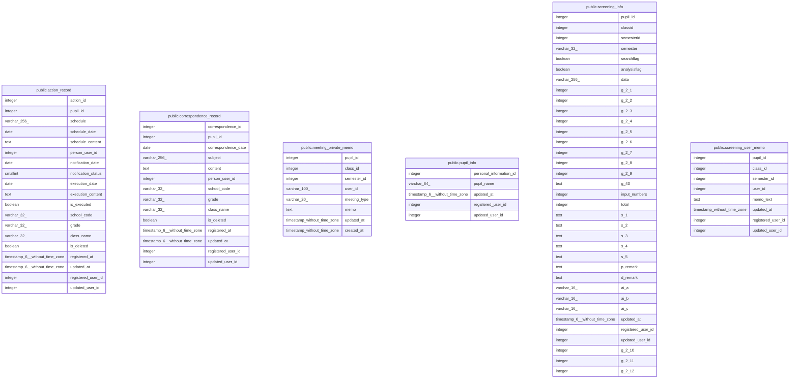

# personaldb

## Tables

| Name | Columns | Comment | Type |
| ---- | ------- | ------- | ---- |
| [public.action_record](public.action_record.md) | 19 | アクション記録テーブル: 児童生徒に紐づくアクション予定・実行記録。学期・クラスとは独立し、進級・転出入後も保持される。 | BASE TABLE |
| [public.correspondence_record](public.correspondence_record.md) | 14 | 対応記録テーブル: 児童生徒に紐づく対応記録。学期・クラスとは独立し、進級・転出入後も保持される。 | BASE TABLE |
| [public.meeting_private_memo](public.meeting_private_memo.md) | 8 | 個人メモ: ユーザーごと・会議種別ごとのプライベートメモ | BASE TABLE |
| [public.pupil_info](public.pupil_info.md) | 5 | 児童生徒情報 | BASE TABLE |
| [public.screening_info](public.screening_info.md) | 35 | スクリーニング情報 | BASE TABLE |
| [public.screening_user_memo](public.screening_user_memo.md) | 8 |  | BASE TABLE |

## Stored procedures and functions

| Name | ReturnType | Arguments | Type |
| ---- | ------- | ------- | ---- |
| public.notify_analysisflag_change | trigger |  | FUNCTION |

## Relations

---

> Generated by [tbls](https://github.com/k1LoW/tbls)
