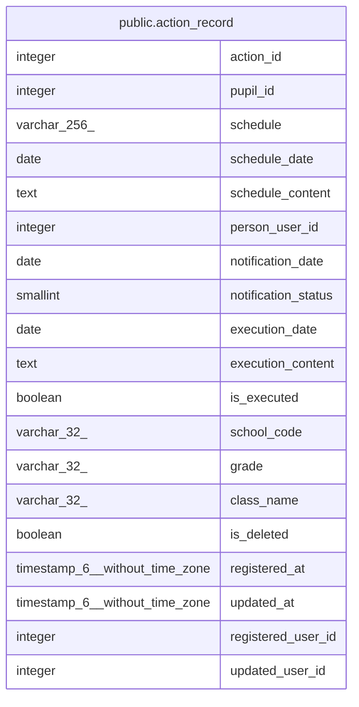

# public.action_record

## Description

アクション記録テーブル: 児童生徒に紐づくアクション予定・実行記録。学期・クラスとは独立し、進級・転出入後も保持される。

## Columns

| Name | Type | Default | Nullable | Children | Parents | Comment |
| ---- | ---- | ------- | -------- | -------- | ------- | ------- |
| action_id | integer | nextval('action_record_action_id_seq'::regclass) | false |  |  |  |
| pupil_id | integer |  | false |  |  | 児童生徒ID: メインDBのpupil.pupil_idとの概念的FK |
| schedule | varchar(256) |  | true |  |  |  |
| schedule_date | date |  | true |  |  |  |
| schedule_content | text |  | true |  |  |  |
| person_user_id | integer |  | true |  |  |  |
| notification_date | date |  | true |  |  |  |
| notification_status | smallint | 0 | false |  |  | 通知ステータス: 0=未通知, 1=通知済み, 2=通知失敗 |
| execution_date | date |  | true |  |  |  |
| execution_content | text |  | true |  |  |  |
| is_executed | boolean | false | false |  |  | 実行済みフラグ: 一覧画面のチェックボックスに対応 |
| school_code | varchar(32) |  | true |  |  |  |
| grade | varchar(32) |  | true |  |  |  |
| class_name | varchar(32) |  | true |  |  |  |
| is_deleted | boolean | false | false |  |  |  |
| registered_at | timestamp(6) without time zone | CURRENT_TIMESTAMP | false |  |  |  |
| updated_at | timestamp(6) without time zone |  | true |  |  |  |
| registered_user_id | integer |  | false |  |  |  |
| updated_user_id | integer |  | true |  |  |  |

## Constraints

| Name | Type | Definition |
| ---- | ---- | ---------- |
| action_record_pkey | PRIMARY KEY | PRIMARY KEY (action_id) |

## Indexes

| Name | Definition |
| ---- | ---------- |
| action_record_pkey | CREATE UNIQUE INDEX action_record_pkey ON public.action_record USING btree (action_id) |
| action_record_ix1 | CREATE INDEX action_record_ix1 ON public.action_record USING btree (pupil_id) |
| action_record_ix2 | CREATE INDEX action_record_ix2 ON public.action_record USING btree (school_code) |
| action_record_ix3 | CREATE INDEX action_record_ix3 ON public.action_record USING btree (person_user_id) |
| action_record_ix4 | CREATE INDEX action_record_ix4 ON public.action_record USING btree (schedule_date) |

## Relations

---

> Generated by [tbls](https://github.com/k1LoW/tbls)
