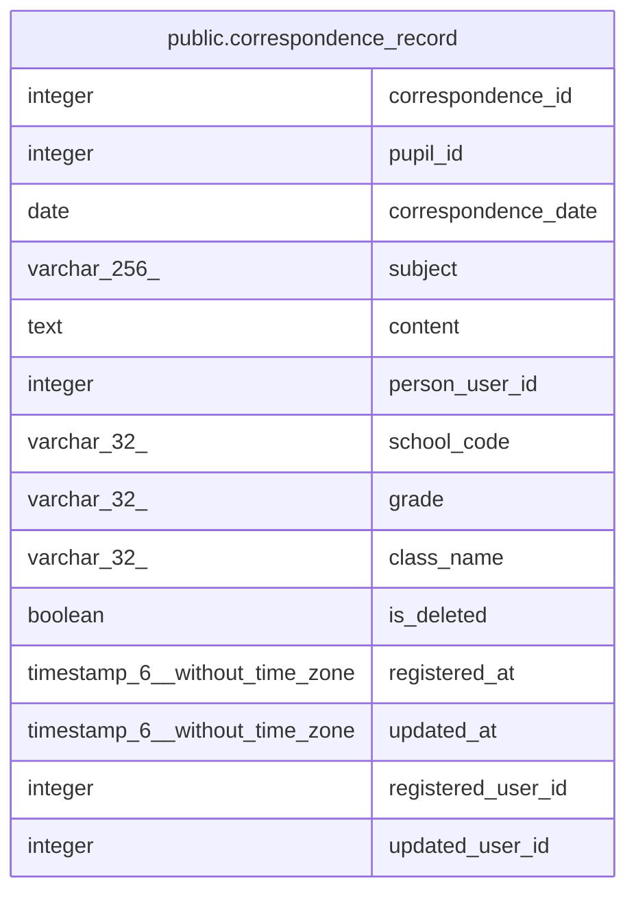

# public.correspondence_record

## Description

対応記録テーブル: 児童生徒に紐づく対応記録。学期・クラスとは独立し、進級・転出入後も保持される。

## Columns

| Name | Type | Default | Nullable | Children | Parents | Comment |
| ---- | ---- | ------- | -------- | -------- | ------- | ------- |
| correspondence_id | integer | nextval('correspondence_record_correspondence_id_seq'::regclass) | false |  |  |  |
| pupil_id | integer |  | false |  |  | 児童生徒ID: メインDBのpupil.pupil_idとの概念的FK |
| correspondence_date | date |  | false |  |  |  |
| subject | varchar(256) |  | true |  |  |  |
| content | text |  | true |  |  |  |
| person_user_id | integer |  | false |  |  |  |
| school_code | varchar(32) |  | true |  |  | 記録時の学校コード（スナップショット） |
| grade | varchar(32) |  | true |  |  | 記録時の学年（スナップショット） |
| class_name | varchar(32) |  | true |  |  | 記録時のクラス（スナップショット） |
| is_deleted | boolean | false | false |  |  |  |
| registered_at | timestamp(6) without time zone | CURRENT_TIMESTAMP | false |  |  |  |
| updated_at | timestamp(6) without time zone |  | true |  |  |  |
| registered_user_id | integer |  | false |  |  |  |
| updated_user_id | integer |  | true |  |  |  |

## Constraints

| Name | Type | Definition |
| ---- | ---- | ---------- |
| correspondence_record_pkey | PRIMARY KEY | PRIMARY KEY (correspondence_id) |

## Indexes

| Name | Definition |
| ---- | ---------- |
| correspondence_record_pkey | CREATE UNIQUE INDEX correspondence_record_pkey ON public.correspondence_record USING btree (correspondence_id) |
| correspondence_record_ix1 | CREATE INDEX correspondence_record_ix1 ON public.correspondence_record USING btree (pupil_id) |
| correspondence_record_ix2 | CREATE INDEX correspondence_record_ix2 ON public.correspondence_record USING btree (school_code) |
| correspondence_record_ix3 | CREATE INDEX correspondence_record_ix3 ON public.correspondence_record USING btree (person_user_id) |
| correspondence_record_ix4 | CREATE INDEX correspondence_record_ix4 ON public.correspondence_record USING btree (correspondence_date) |

## Relations

---

> Generated by [tbls](https://github.com/k1LoW/tbls)
