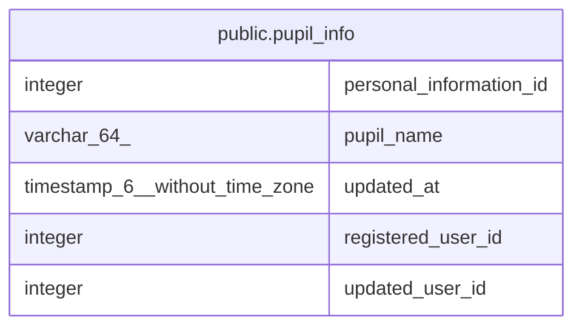

# public.pupil_info

## Description

児童生徒情報

## Columns

| Name | Type | Default | Nullable | Children | Parents | Comment |
| ---- | ---- | ------- | -------- | -------- | ------- | ------- |
| personal_information_id | integer |  | false |  |  | 個人情報ID |
| pupil_name | varchar(64) |  | true |  |  | 児童生徒名 |
| updated_at | timestamp(6) without time zone |  | false |  |  | 更新日時 |
| registered_user_id | integer |  | true |  |  | 登録ユーザID |
| updated_user_id | integer |  | true |  |  | 更新ユーザID |

## Constraints

| Name | Type | Definition |
| ---- | ---- | ---------- |
| pupil_info_pkey | PRIMARY KEY | PRIMARY KEY (personal_information_id) |

## Indexes

| Name | Definition |
| ---- | ---------- |
| pupil_info_pkey | CREATE UNIQUE INDEX pupil_info_pkey ON public.pupil_info USING btree (personal_information_id) |

## Relations

---

> Generated by [tbls](https://github.com/k1LoW/tbls)
