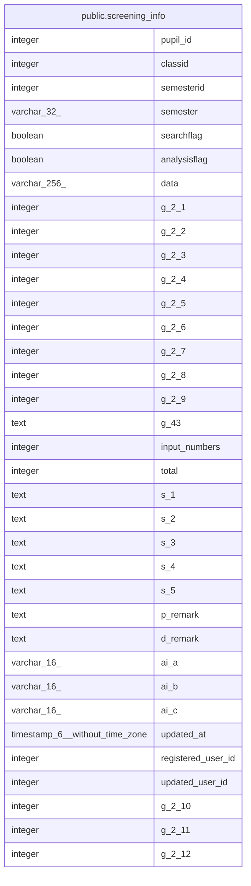

# public.screening_info

## Description

スクリーニング情報

## Columns

| Name | Type | Default | Nullable | Children | Parents | Comment |
| ---- | ---- | ------- | -------- | -------- | ------- | ------- |
| pupil_id | integer |  | false |  |  | 児童生徒ID |
| classid | integer |  | false |  |  | クラスID |
| semesterid | integer |  | false |  |  | 期別ID |
| semester | varchar(32) |  | true |  |  | 期別 |
| searchflag | boolean |  | false |  |  | 検索対象フラグ |
| analysisflag | boolean |  | false |  |  | 解析実施フラグ |
| data | varchar(256) |  | true |  |  | スクリーニングデータ (85文字連結) |
| g_2_1 | integer |  | true |  |  | 欠席日数-小学1年 |
| g_2_2 | integer |  | true |  |  | 欠席日数-小学2年 |
| g_2_3 | integer |  | true |  |  | 欠席日数-小学3年 |
| g_2_4 | integer |  | true |  |  | 欠席日数-小学4年 |
| g_2_5 | integer |  | true |  |  | 欠席日数-小学5年 |
| g_2_6 | integer |  | true |  |  | 欠席日数-小学6年 |
| g_2_7 | integer |  | true |  |  | 欠席日数-中学1年 |
| g_2_8 | integer |  | true |  |  | 欠席日数-中学2年 |
| g_2_9 | integer |  | true |  |  | 欠席日数-中学3年 |
| g_43 | text |  | true |  |  | その他・備考 |
| input_numbers | integer |  | true |  |  | 項目の入力件数 |
| total | integer |  | true |  |  | 合計 |
| s_1 | text |  | true |  |  | 子どもの背景 |
| s_2 | text |  | true |  |  | 具体的なワンポイント内容 |
| s_3 | text |  | true |  |  | 校内チーム会議に上げる |
| s_4 | text |  | true |  |  | 校内チーム会議AI判定 |
| s_5 | text |  | true |  |  | 複数人で出した今後の方向性 |
| p_remark | text |  | true |  |  | 支援の現状-備考 |
| d_remark | text |  | true |  |  | 支援の方向性-備考 |
| ai_a | varchar(16) |  | true |  |  | A：教職員の関与（AI判定） |
| ai_b | varchar(16) |  | true |  |  | B：地域資源の活用（AI判定） |
| ai_c | varchar(16) |  | true |  |  | C：専門機関の活動（AI判定） |
| updated_at | timestamp(6) without time zone |  | false |  |  | 更新日時 |
| registered_user_id | integer |  | true |  |  | 登録ユーザID |
| updated_user_id | integer |  | true |  |  | 更新ユーザID |
| g_2_10 | integer |  | true |  |  | 欠席日数-学年10 |
| g_2_11 | integer |  | true |  |  | 欠席日数-学年11 |
| g_2_12 | integer |  | true |  |  | 欠席日数-学年12 |

## Constraints

| Name | Type | Definition |
| ---- | ---- | ---------- |
| screening_info_pkey | PRIMARY KEY | PRIMARY KEY (pupil_id, classid, semesterid) |

## Indexes

| Name | Definition |
| ---- | ---------- |
| screening_info_pkey | CREATE UNIQUE INDEX screening_info_pkey ON public.screening_info USING btree (pupil_id, classid, semesterid) |

## Triggers

| Name | Definition |
| ---- | ---------- |
| trg_analysisflag_change | CREATE TRIGGER trg_analysisflag_change AFTER INSERT OR UPDATE OF analysisflag ON public.screening_info FOR EACH ROW EXECUTE FUNCTION notify_analysisflag_change() |

## Relations

---

> Generated by [tbls](https://github.com/k1LoW/tbls)
