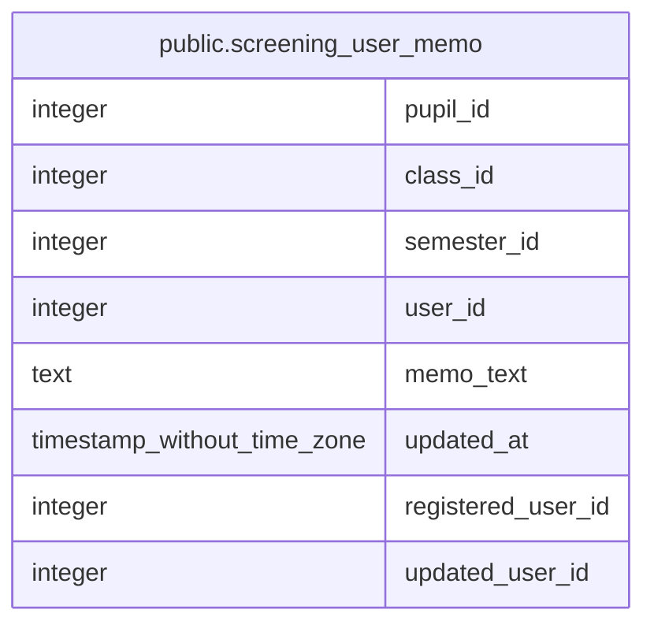

# public.screening_user_memo

## Columns

| Name | Type | Default | Nullable | Children | Parents | Comment |
| ---- | ---- | ------- | -------- | -------- | ------- | ------- |
| pupil_id | integer |  | false |  |  |  |
| class_id | integer |  | false |  |  |  |
| semester_id | integer |  | false |  |  |  |
| user_id | integer |  | false |  |  |  |
| memo_text | text |  | true |  |  |  |
| updated_at | timestamp without time zone | CURRENT_TIMESTAMP | false |  |  |  |
| registered_user_id | integer |  | true |  |  |  |
| updated_user_id | integer |  | true |  |  |  |

## Constraints

| Name | Type | Definition |
| ---- | ---- | ---------- |
| screening_user_memo_pkey | PRIMARY KEY | PRIMARY KEY (pupil_id, class_id, semester_id, user_id) |

## Indexes

| Name | Definition |
| ---- | ---------- |
| screening_user_memo_pkey | CREATE UNIQUE INDEX screening_user_memo_pkey ON public.screening_user_memo USING btree (pupil_id, class_id, semester_id, user_id) |

## Relations

---

> Generated by [tbls](https://github.com/k1LoW/tbls)
